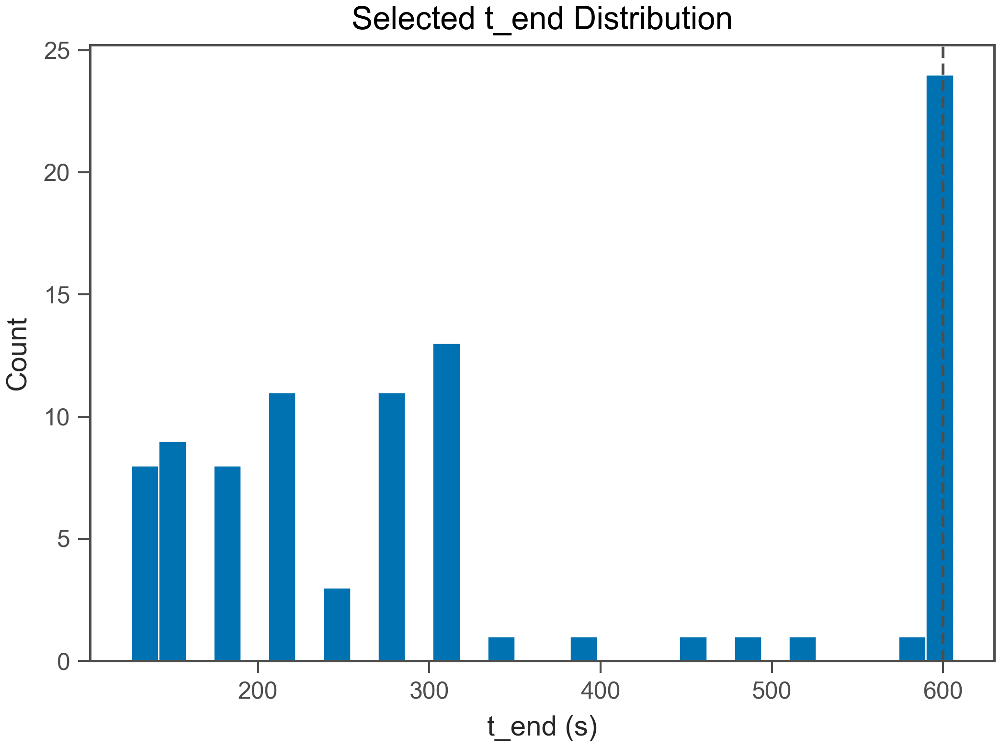
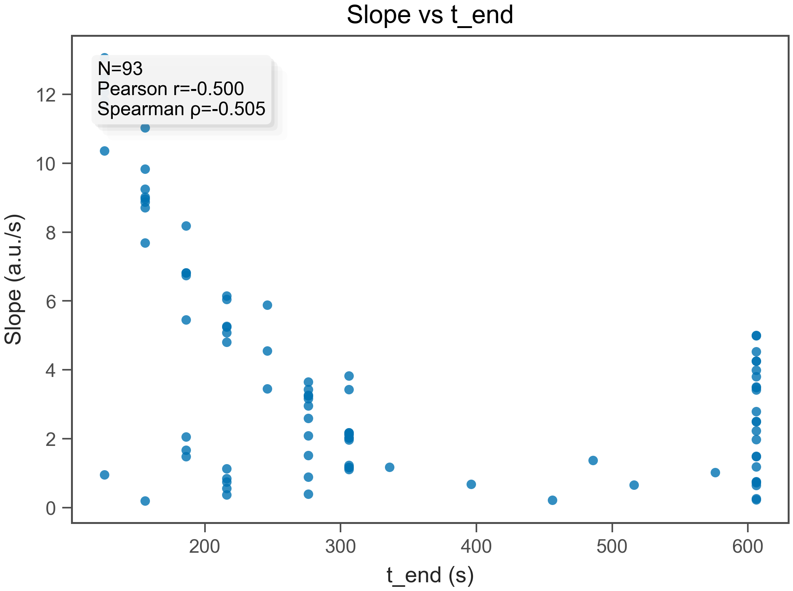
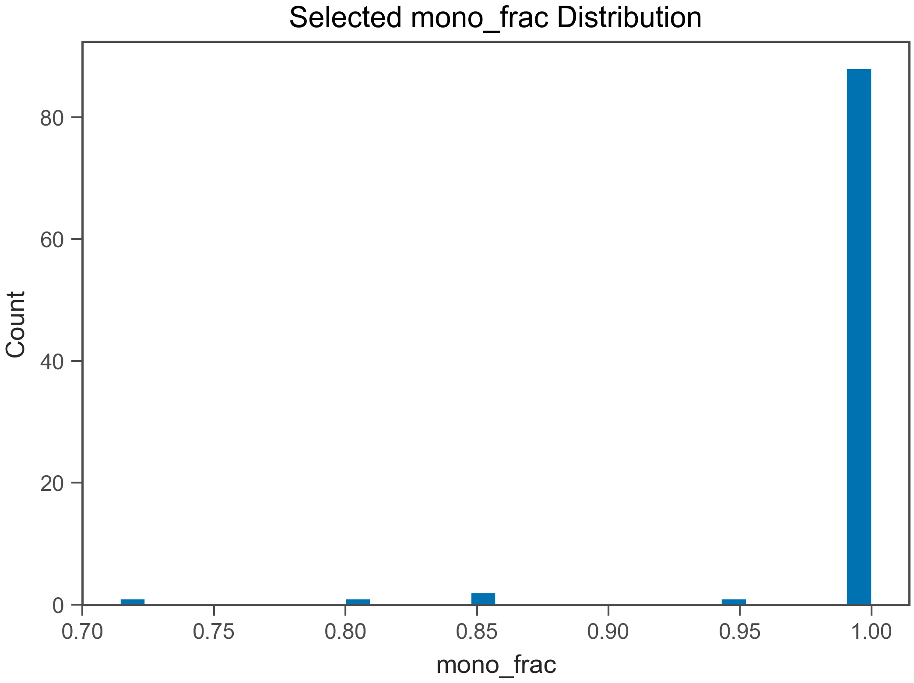

# Fit QC Report

- Generated: 2026-02-04 11:06:02.345226

## (a) OK / EXCLUDED
- Total wells: 98
- OK: 93
- EXCLUDED: 5
- OK rate: 94.9%

- CSV: fit_qc_summary_overall.csv
- CSV (by plate): fit_qc_summary_by_plate.csv
- CSV (by heat): fit_qc_summary_by_heat.csv

## (b) Selected t_end distribution
- t_end min/max: 126 / 606 s
- q10: 156 s
- q25: 186 s
- q50: 276 s
- q75: 606 s
- q90: 606 s

- t_end ≤ 30 s : 0.0%
- t_end ≤ 60 s : 0.0%
- t_end ≤ 120 s : 0.0%
- t_end ≤ 240 s : 38.7%
- t_end ≤ 600 s : 74.2%

## (c) Slope vs t_end
- N (finite): 93
- Pearson r: -0.4999
- Spearman ρ: -0.5055

## (d) select_method_used breakdown (OK only)
- method column used: select_method_used
- force_whole* fraction (among OK): 0.0%
- force_whole* fraction (among ALL wells): 0.0%

- CSV: fit_qc_select_method_counts.csv
- initial_positive_ext_tangent: 51 (54.8%)
- initial_positive_ext: 21 (22.6%)
- full_range_outlier_skip: 7 (7.5%)
- last_resort: 7 (7.5%)
- initial_positive: 5 (5.4%)
- outlier_removed: 1 (1.1%)
- initial_positive_ext_intskip1_tangent: 1 (1.1%)

## (e) Distributions (OK only)
### R²
- R² min/max: 0.5571 / 1
- R² q10: 0.9257
- R² q25: 0.9851
- R² q50: 0.9906
- R² q75: 0.9955
- R² q90: 0.9994

### mono_frac
- mono_frac min/max: 0.7143 / 1
- mono_frac q10: 1
- mono_frac q25: 1
- mono_frac q50: 1
- mono_frac q75: 1
- mono_frac q90: 1

### snr
- snr min/max: 2.773 / 320.1
- snr q10: 10.52
- snr q25: 22.46
- snr q50: 29.02
- snr q75: 36.51
- snr q90: 51.1

## (f) Exclude reasons (EXCLUDED only)
- CSV: fit_qc_exclude_reason_norm_counts.csv
- R² < r2_min: 4 (80.0%)
- Slope < slope_min: 1 (20.0%)

