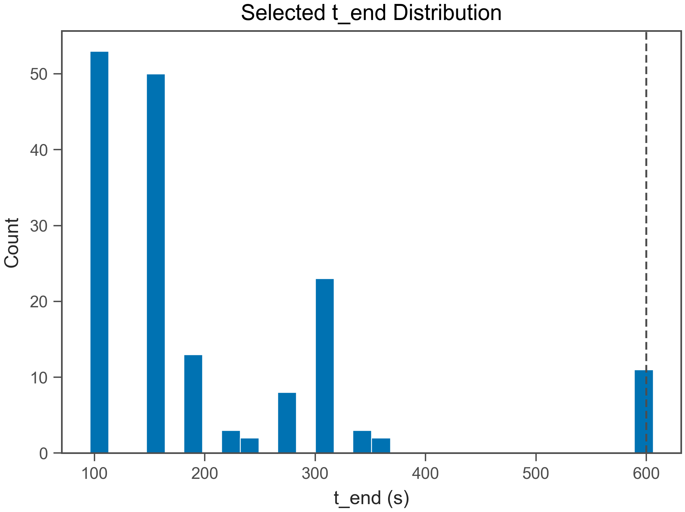
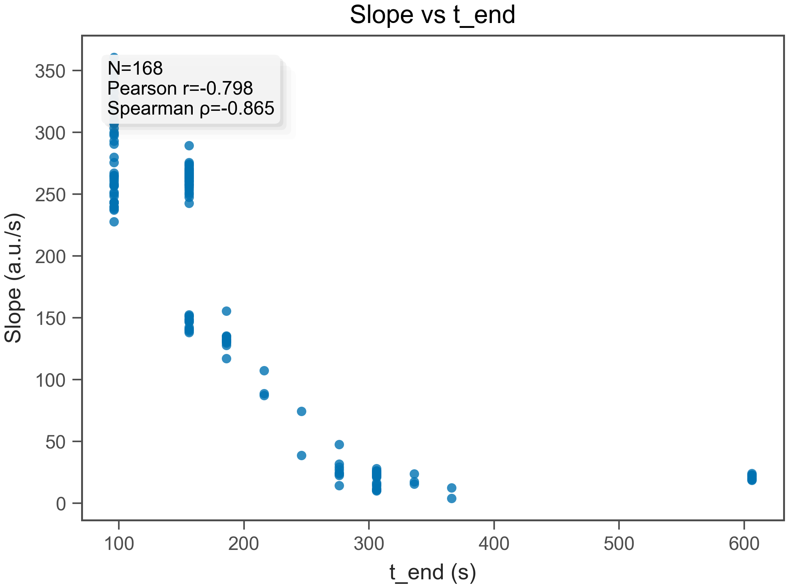
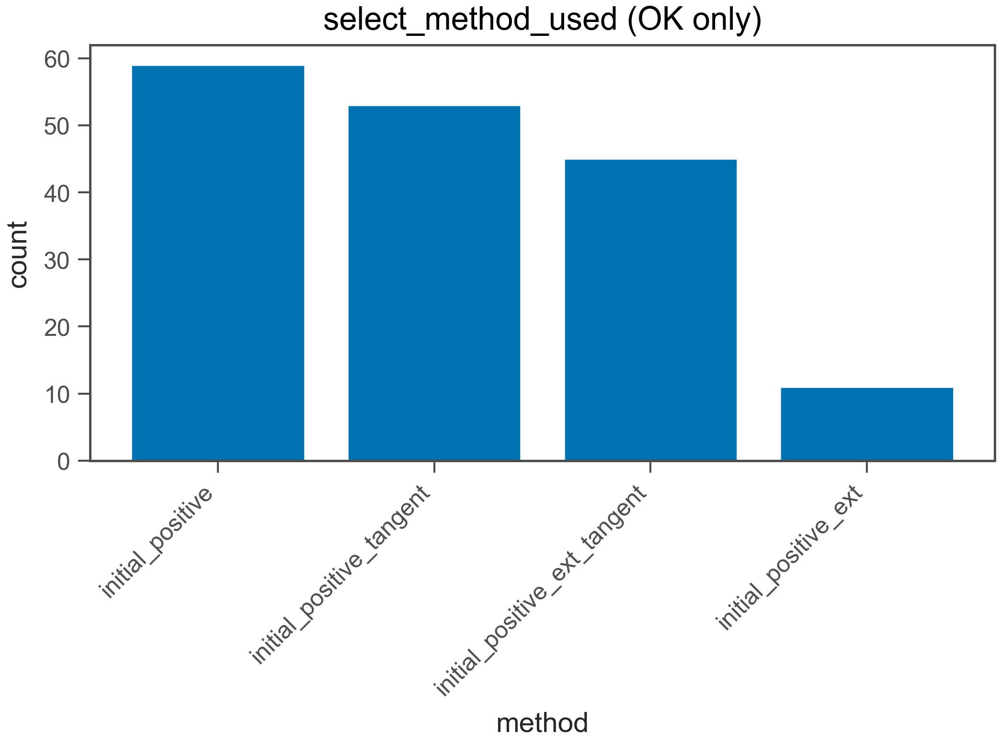
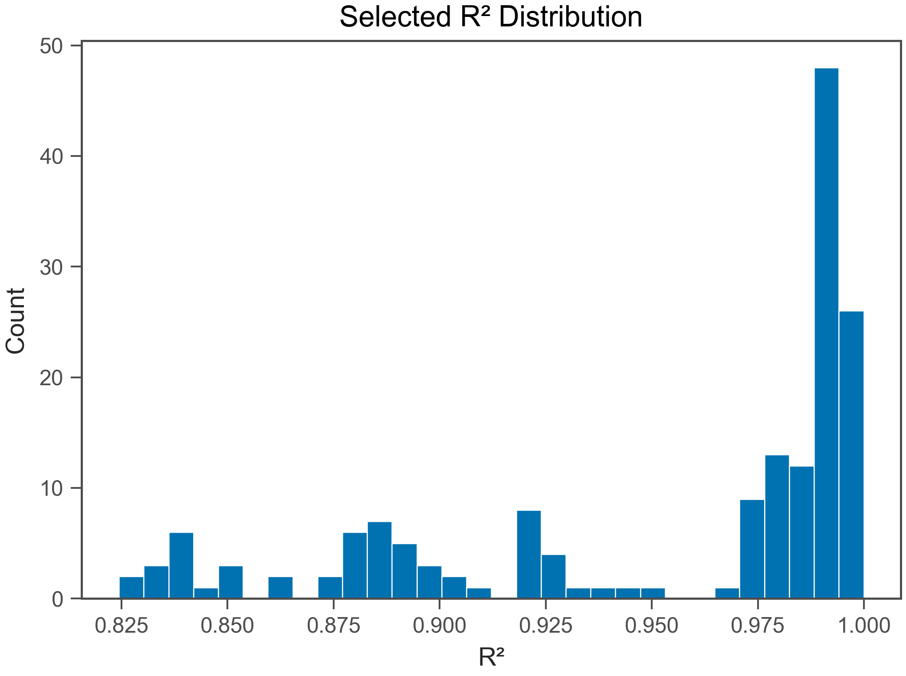
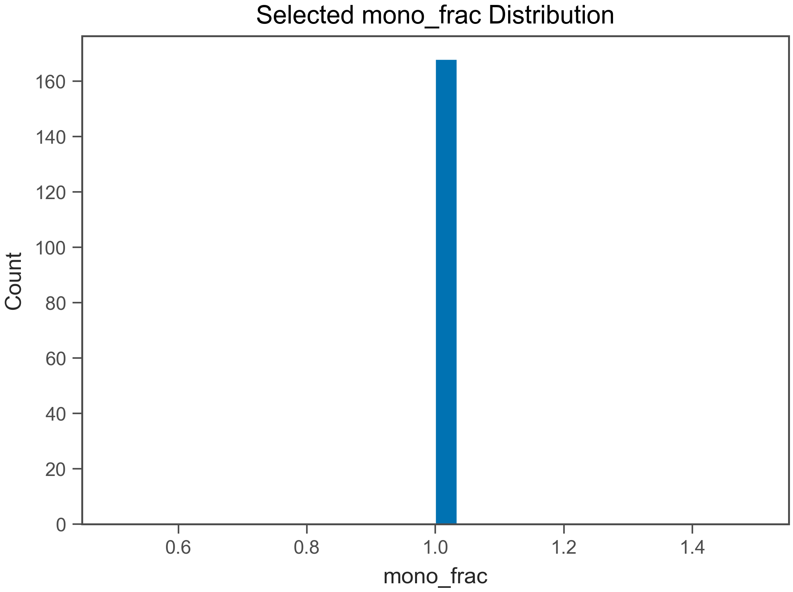
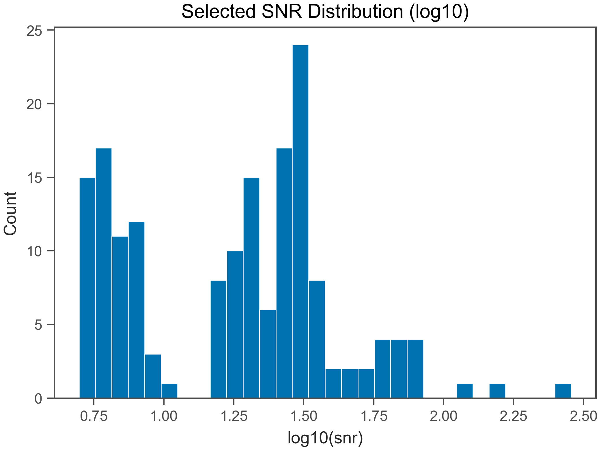

# Fit QC Report

- Generated: 2026-02-03 23:18:59.892196

## (a) OK / EXCLUDED
- Total wells: 168
- OK: 168
- EXCLUDED: 0
- OK rate: 100.0%

- CSV: fit_qc_summary_overall.csv
- CSV (by plate): fit_qc_summary_by_plate.csv
- CSV (by heat): fit_qc_summary_by_heat.csv

## (b) Selected t_end distribution
- t_end min/max: 96 / 606 s
- q10: 96 s
- q25: 96 s
- q50: 156 s
- q75: 276 s
- q90: 306 s

- t_end ≤ 30 s : 0.0%
- t_end ≤ 60 s : 0.0%
- t_end ≤ 120 s : 31.5%
- t_end ≤ 240 s : 70.8%
- t_end ≤ 600 s : 93.5%

## (c) Slope vs t_end
- N (finite): 168
- Pearson r: -0.7981
- Spearman ρ: -0.8651

## (d) select_method_used breakdown (OK only)
- method column used: select_method_used
- force_whole* fraction (among OK): 0.0%
- force_whole* fraction (among ALL wells): 0.0%

- CSV: fit_qc_select_method_counts.csv
- initial_positive: 59 (35.1%)
- initial_positive_tangent: 53 (31.5%)
- initial_positive_ext_tangent: 45 (26.8%)
- initial_positive_ext: 11 (6.5%)

## (e) Distributions (OK only)
### R²
- R² min/max: 0.8244 / 0.9999
- R² q10: 0.8698
- R² q25: 0.9054
- R² q50: 0.9827
- R² q75: 0.9915
- R² q90: 0.9978

### mono_frac
- mono_frac min/max: 1 / 1
- mono_frac q10: 1
- mono_frac q25: 1
- mono_frac q50: 1
- mono_frac q75: 1
- mono_frac q90: 1

### snr
- snr min/max: 4.972 / 285.5
- snr q10: 5.969
- snr q25: 7.173
- snr q50: 20.28
- snr q75: 30.53
- snr q90: 46.69

## (f) Exclude reasons (EXCLUDED only)
- excluded wells: 0
