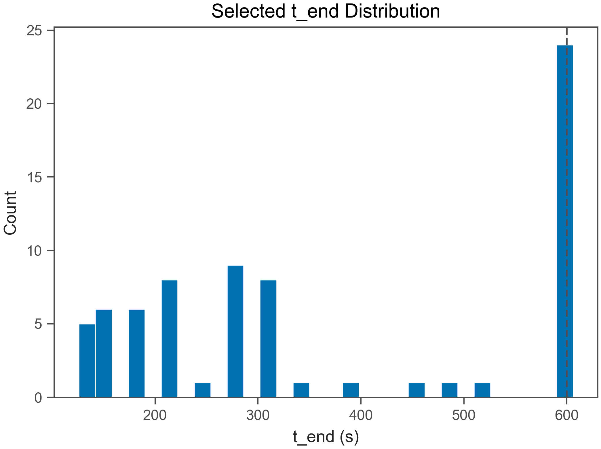
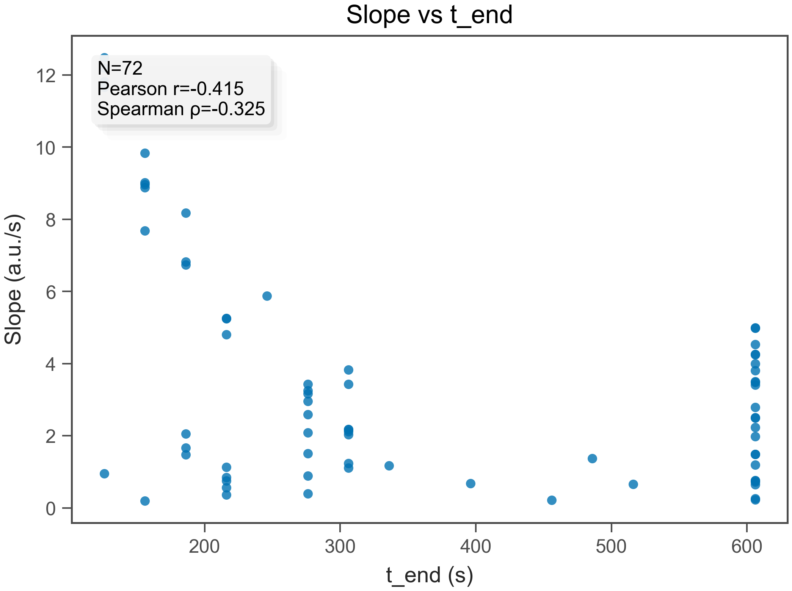
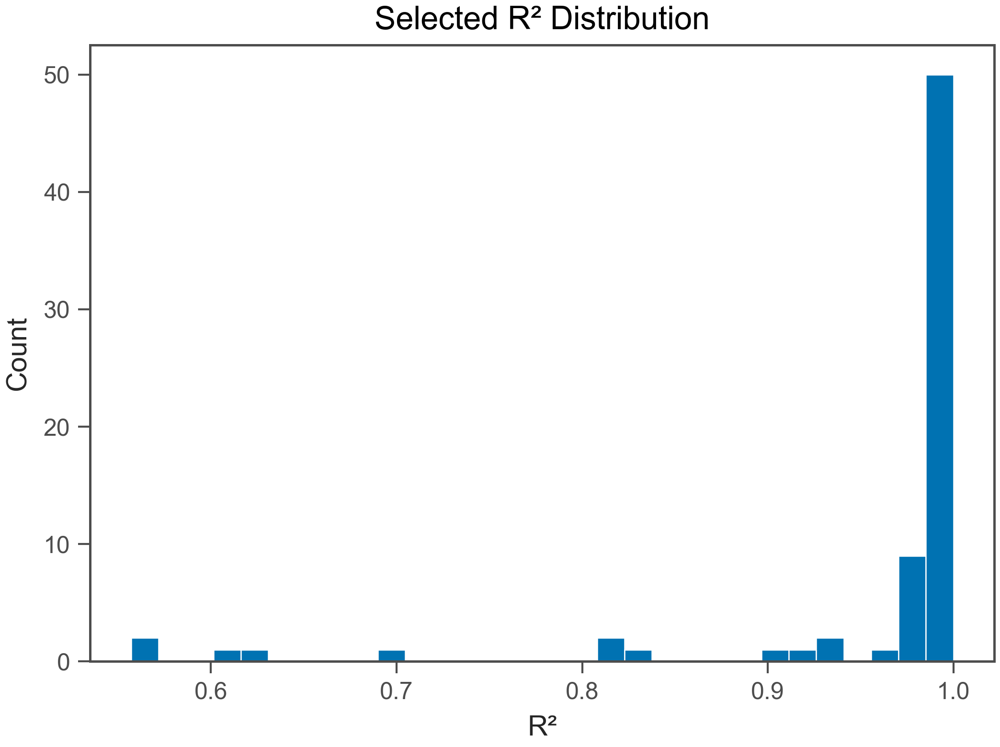
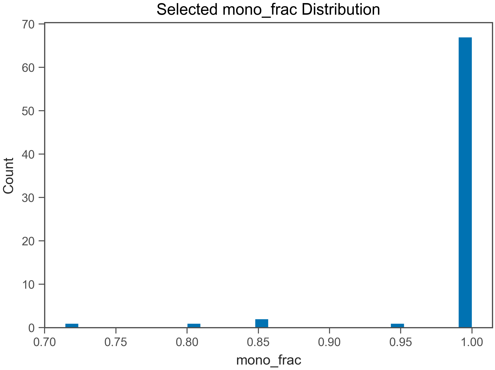
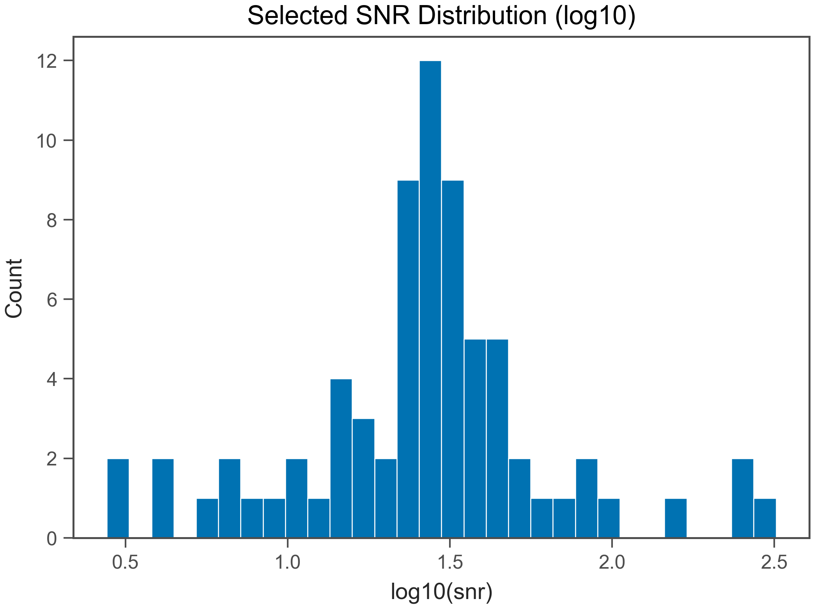
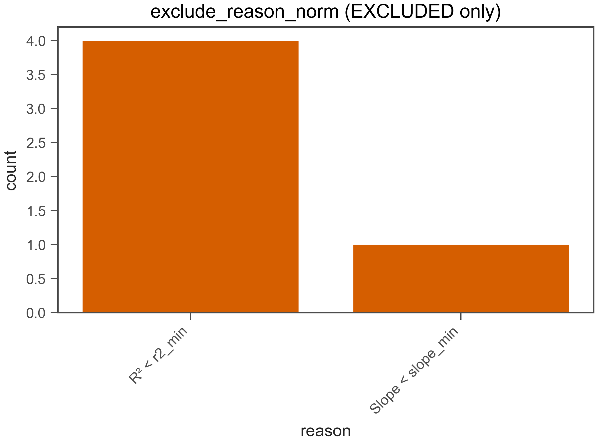

# Fit QC Report

- Generated: 2026-02-04 13:46:09.356494

## (a) OK / EXCLUDED
- Total wells: 77
- OK: 72
- EXCLUDED: 5
- OK rate: 93.5%

- CSV: fit_qc_summary_overall.csv
- CSV (by plate): fit_qc_summary_by_plate.csv
- CSV (by heat): fit_qc_summary_by_heat.csv

## (b) Selected t_end distribution
- t_end min/max: 126 / 606 s
- q10: 156 s
- q25: 216 s
- q50: 306 s
- q75: 606 s
- q90: 606 s

- t_end ≤ 30 s : 0.0%
- t_end ≤ 60 s : 0.0%
- t_end ≤ 120 s : 0.0%
- t_end ≤ 240 s : 34.7%
- t_end ≤ 600 s : 66.7%

## (c) Slope vs t_end
- N (finite): 72
- Pearson r: -0.415
- Spearman ρ: -0.3251

## (d) select_method_used breakdown (OK only)
- method column used: select_method_used
- force_whole* fraction (among OK): 0.0%
- force_whole* fraction (among ALL wells): 0.0%

- CSV: fit_qc_select_method_counts.csv
- initial_positive_ext_tangent: 31 (43.1%)
- initial_positive_ext: 21 (29.2%)
- last_resort: 7 (9.7%)
- full_range_outlier_skip: 6 (8.3%)
- initial_positive: 5 (6.9%)
- outlier_removed: 1 (1.4%)
- initial_positive_ext_intskip1_tangent: 1 (1.4%)

## (e) Distributions (OK only)
### R²
- R² min/max: 0.5571 / 1
- R² q10: 0.8349
- R² q25: 0.984
- R² q50: 0.9909
- R² q75: 0.9969
- R² q90: 0.9996

### mono_frac
- mono_frac min/max: 0.7143 / 1
- mono_frac q10: 1
- mono_frac q25: 1
- mono_frac q50: 1
- mono_frac q75: 1
- mono_frac q90: 1

### snr
- snr min/max: 2.773 / 320.1
- snr q10: 7.649
- snr q25: 17.83
- snr q50: 27.79
- snr q75: 38.48
- snr q90: 69.78

## (f) Exclude reasons (EXCLUDED only)
- CSV: fit_qc_exclude_reason_norm_counts.csv
- R² < r2_min: 4 (80.0%)
- Slope < slope_min: 1 (20.0%)

