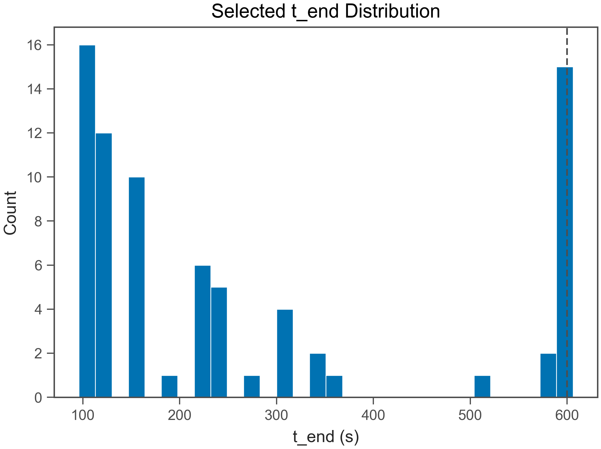
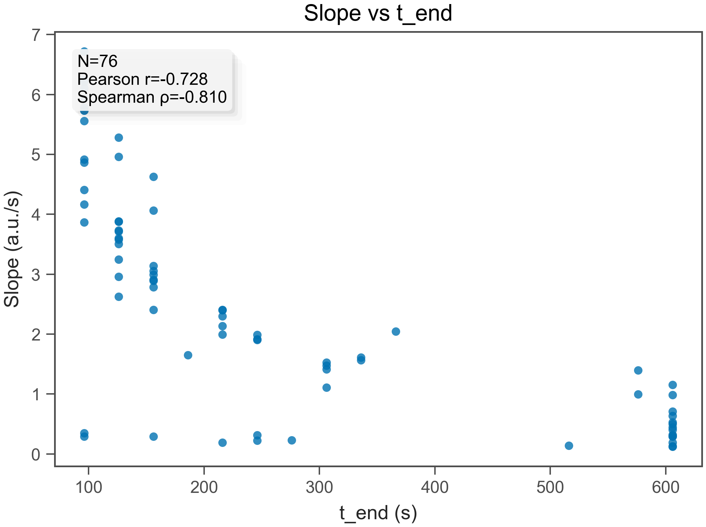
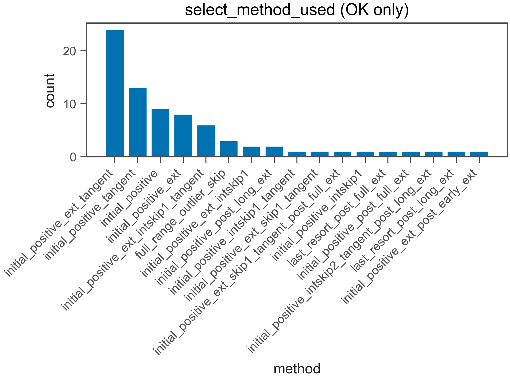
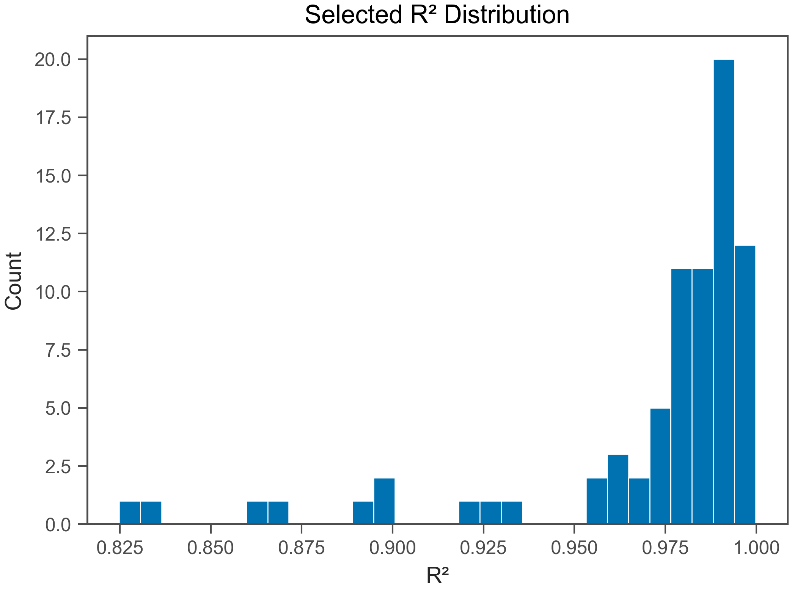
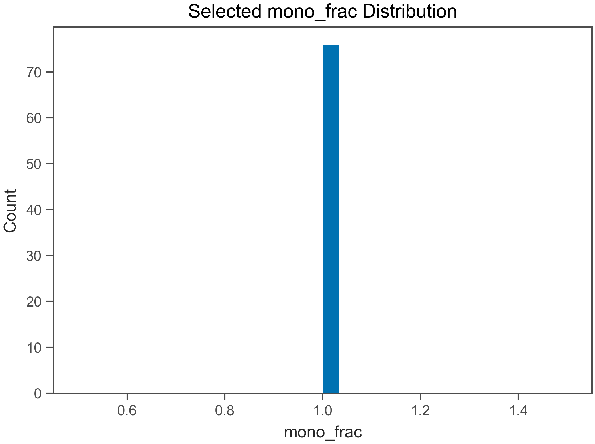
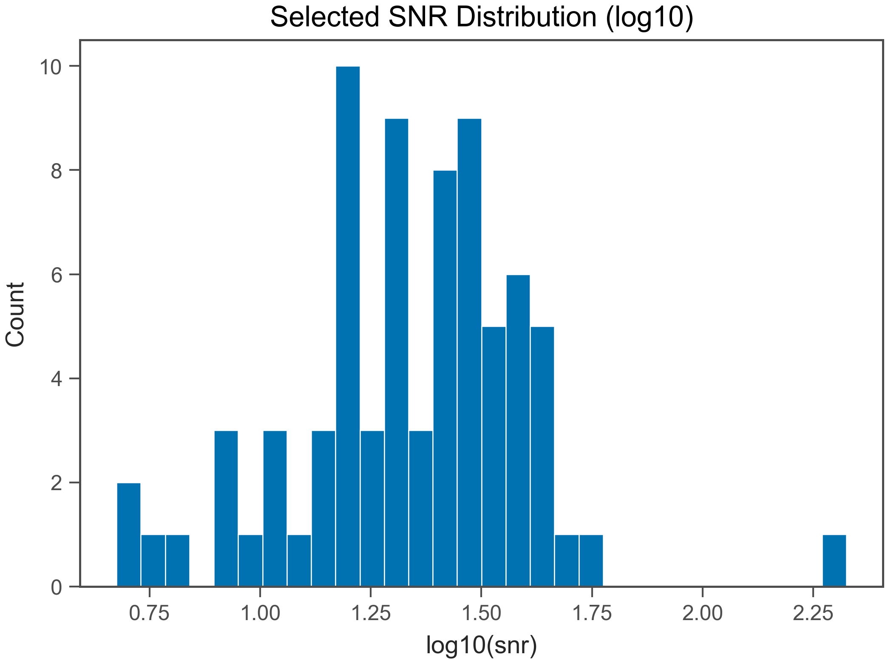
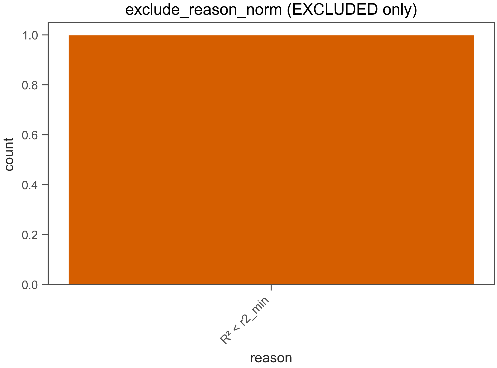

# Fit QC Report

- Generated: 2026-02-06 14:31:33.374859

## (a) OK / EXCLUDED
- Total wells: 77
- OK: 76
- EXCLUDED: 1
- OK rate: 98.7%

- CSV: fit_qc_summary_overall.csv
- CSV (by plate): fit_qc_summary_by_plate.csv
- CSV (by heat): fit_qc_summary_by_heat.csv

## (b) Selected t_end distribution
- t_end min/max: 96 / 606 s
- q10: 96 s
- q25: 126 s
- q50: 171 s
- q75: 344 s
- q90: 606 s

- t_end ≤ 30 s : 0.0%
- t_end ≤ 60 s : 0.0%
- t_end ≤ 120 s : 21.1%
- t_end ≤ 240 s : 59.2%
- t_end ≤ 600 s : 80.3%

## (c) Slope vs t_end
- N (finite): 76
- Pearson r: -0.7279
- Spearman ρ: -0.8097

## (d) select_method_used breakdown (OK only)
- method column used: select_method_used
- force_whole* fraction (among OK): 0.0%
- force_whole* fraction (among ALL wells): 0.0%

- CSV: fit_qc_select_method_counts.csv
- initial_positive_ext_tangent: 24 (31.6%)
- initial_positive_tangent: 13 (17.1%)
- initial_positive: 9 (11.8%)
- initial_positive_ext: 8 (10.5%)
- initial_positive_ext_intskip1_tangent: 6 (7.9%)
- full_range_outlier_skip: 3 (3.9%)
- initial_positive_ext_intskip1: 2 (2.6%)
- initial_positive_post_long_ext: 2 (2.6%)
- initial_positive_intskip1_tangent: 1 (1.3%)
- initial_positive_ext_skip1_tangent: 1 (1.3%)
- initial_positive_ext_skip1_tangent_post_full_ext: 1 (1.3%)
- initial_positive_intskip1: 1 (1.3%)
- last_resort_post_full_ext: 1 (1.3%)
- initial_positive_post_full_ext: 1 (1.3%)
- initial_positive_intskip2_tangent_post_long_ext: 1 (1.3%)
- last_resort_post_long_ext: 1 (1.3%)
- initial_positive_ext_post_early_ext: 1 (1.3%)

## (e) Distributions (OK only)
### R²
- R² min/max: 0.8248 / 0.9998
- R² q10: 0.9246
- R² q25: 0.9721
- R² q50: 0.9864
- R² q75: 0.9916
- R² q90: 0.9947

### mono_frac
- mono_frac min/max: 1 / 1
- mono_frac q10: 1
- mono_frac q25: 1
- mono_frac q50: 1
- mono_frac q75: 1
- mono_frac q90: 1

### snr
- snr min/max: 4.734 / 211.5
- snr q10: 9.893
- snr q25: 15.78
- snr q50: 23.05
- snr q75: 31.67
- snr q90: 40.82

## (f) Exclude reasons (EXCLUDED only)
- CSV: fit_qc_exclude_reason_norm_counts.csv
- R² < r2_min: 1 (100.0%)

