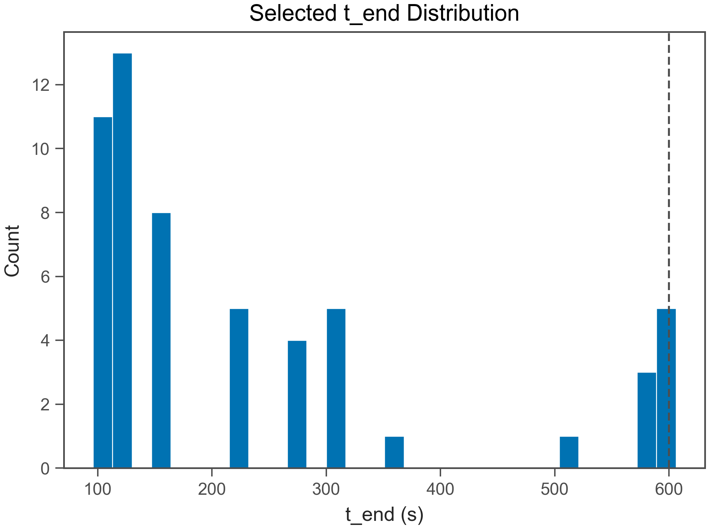
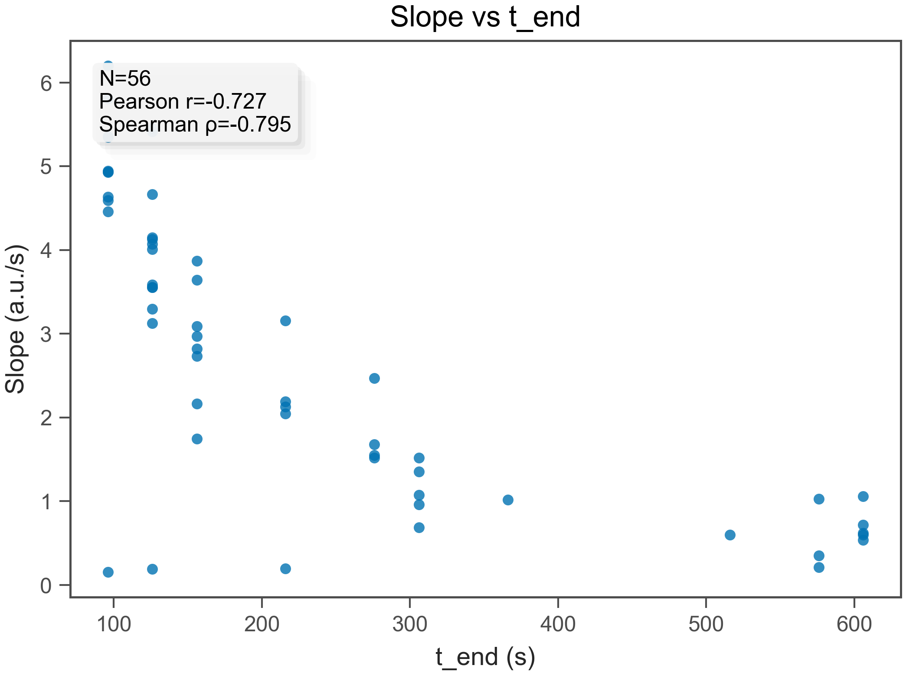
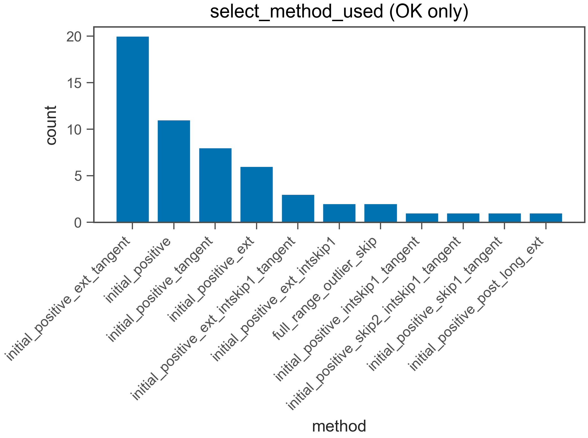
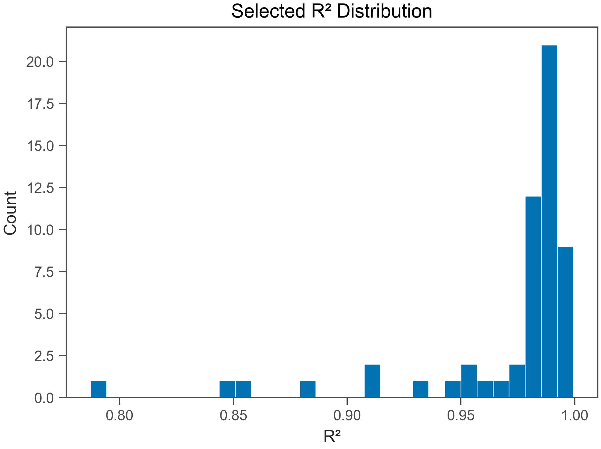
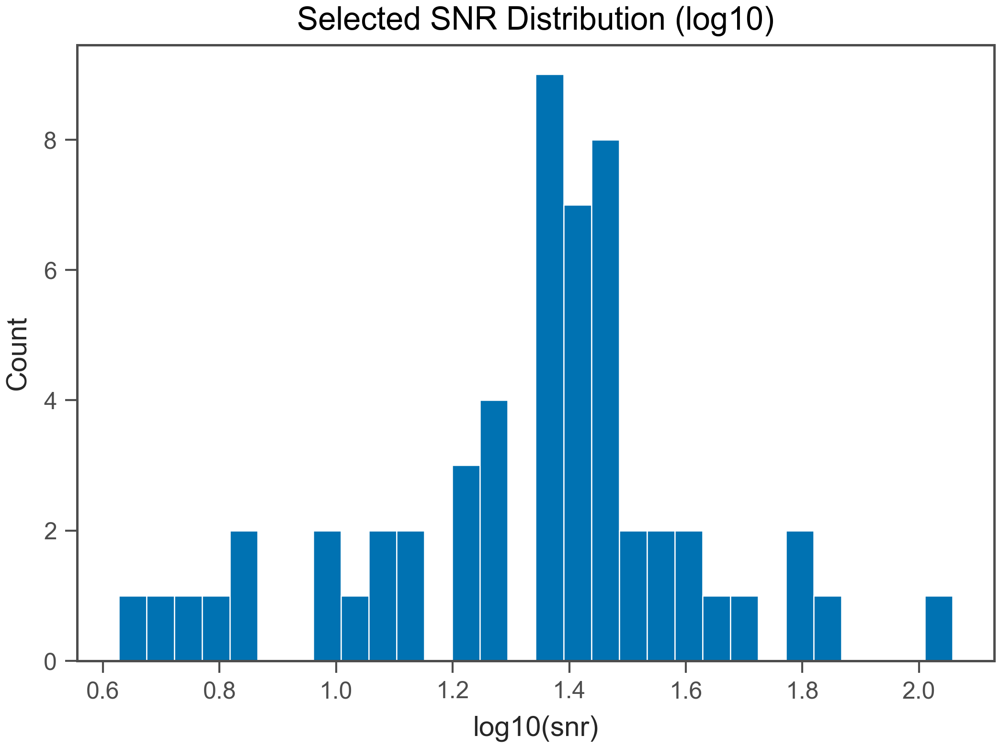

# Fit QC Report

- Generated: 2026-02-06 13:01:45.026330

## (a) OK / EXCLUDED
- Total wells: 56
- OK: 56
- EXCLUDED: 0
- OK rate: 100.0%

- CSV: fit_qc_summary_overall.csv
- CSV (by plate): fit_qc_summary_by_plate.csv
- CSV (by heat): fit_qc_summary_by_heat.csv

## (b) Selected t_end distribution
- t_end min/max: 96 / 606 s
- q10: 96 s
- q25: 126 s
- q50: 156 s
- q75: 306 s
- q90: 576 s

- t_end ≤ 30 s : 0.0%
- t_end ≤ 60 s : 0.0%
- t_end ≤ 120 s : 19.6%
- t_end ≤ 240 s : 66.1%
- t_end ≤ 600 s : 91.1%

## (c) Slope vs t_end
- N (finite): 56
- Pearson r: -0.7265
- Spearman ρ: -0.7947

## (d) select_method_used breakdown (OK only)
- method column used: select_method_used
- force_whole* fraction (among OK): 0.0%
- force_whole* fraction (among ALL wells): 0.0%

- CSV: fit_qc_select_method_counts.csv
- initial_positive_ext_tangent: 20 (35.7%)
- initial_positive: 11 (19.6%)
- initial_positive_tangent: 8 (14.3%)
- initial_positive_ext: 6 (10.7%)
- initial_positive_ext_intskip1_tangent: 3 (5.4%)
- initial_positive_ext_intskip1: 2 (3.6%)
- full_range_outlier_skip: 2 (3.6%)
- initial_positive_intskip1_tangent: 1 (1.8%)
- initial_positive_skip2_intskip1_tangent: 1 (1.8%)
- initial_positive_skip1_tangent: 1 (1.8%)
- initial_positive_post_long_ext: 1 (1.8%)

## (e) Distributions (OK only)
### R²
- R² min/max: 0.7871 / 0.9994
- R² q10: 0.9211
- R² q25: 0.9788
- R² q50: 0.9862
- R² q75: 0.99
- R² q90: 0.9944

### mono_frac
- mono_frac min/max: 0.9474 / 1
- mono_frac q10: 1
- mono_frac q25: 1
- mono_frac q50: 1
- mono_frac q75: 1
- mono_frac q90: 1

### snr
- snr min/max: 4.234 / 114.3
- snr q10: 8.263
- snr q25: 17.3
- snr q50: 24
- snr q75: 30.06
- snr q90: 41.45

## (f) Exclude reasons (EXCLUDED only)
- excluded wells: 0
