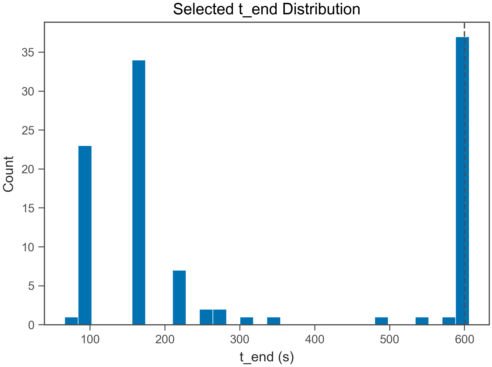
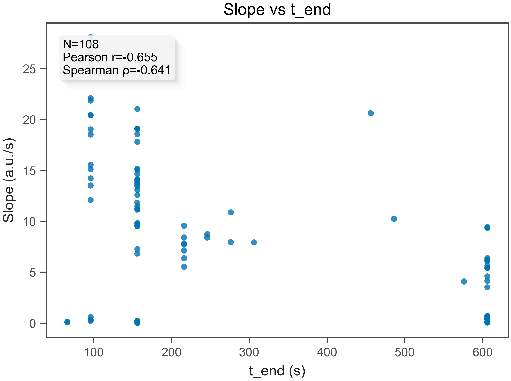
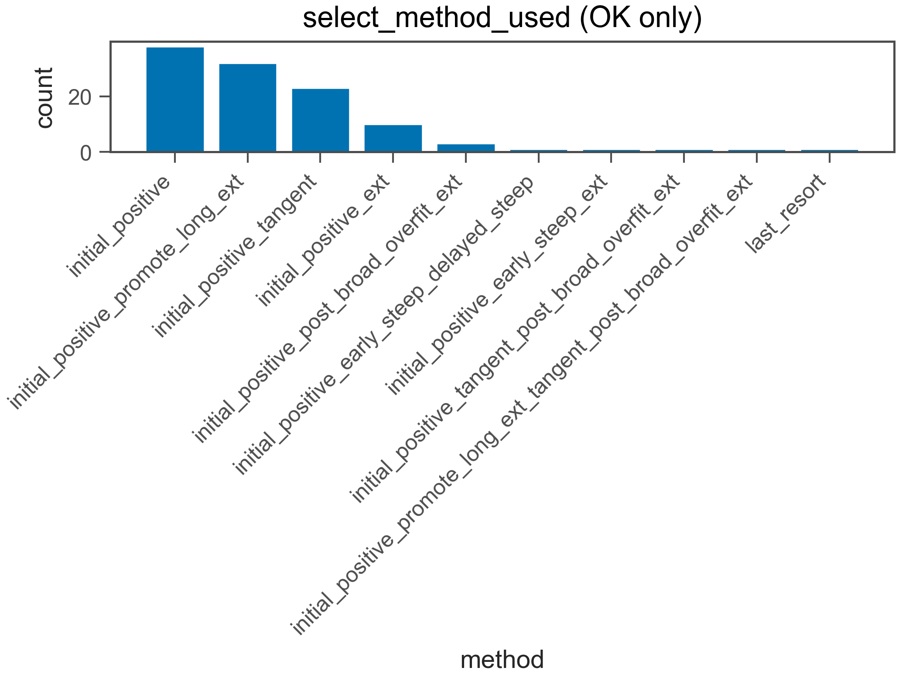
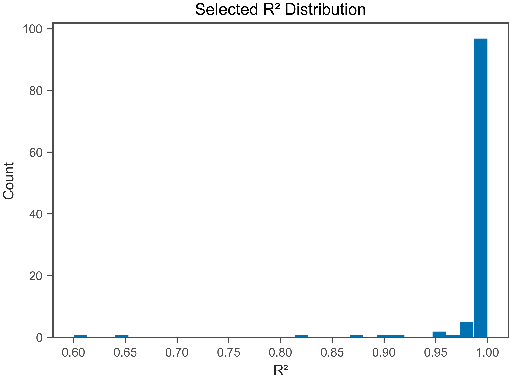
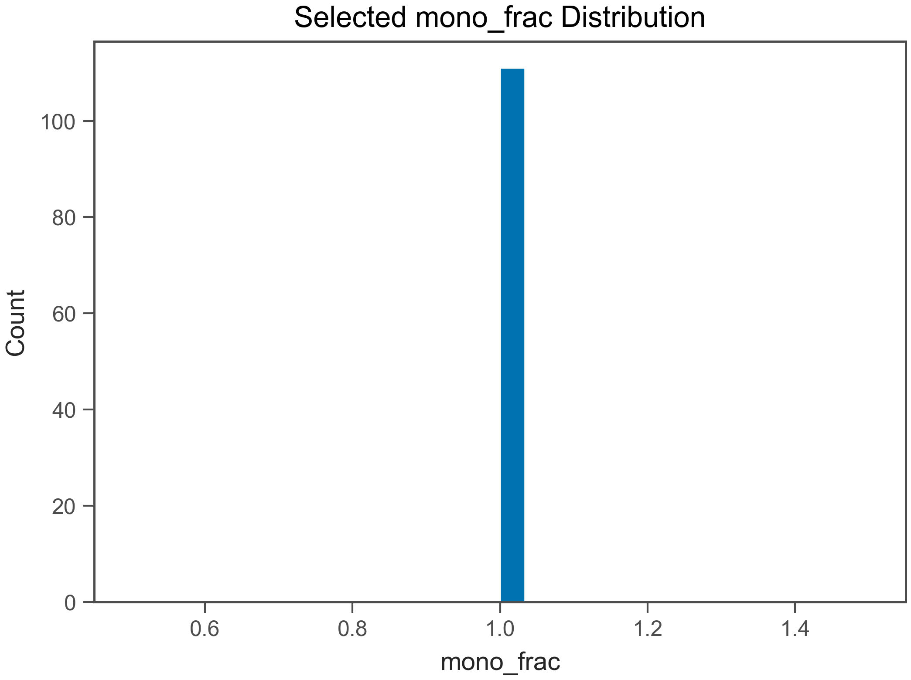
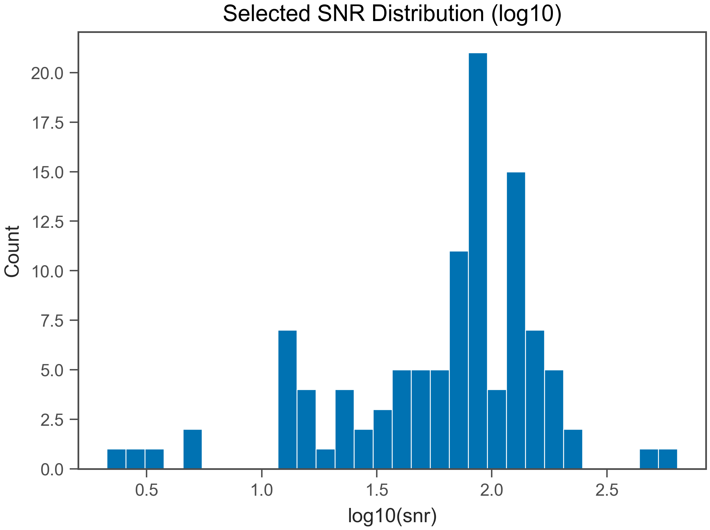
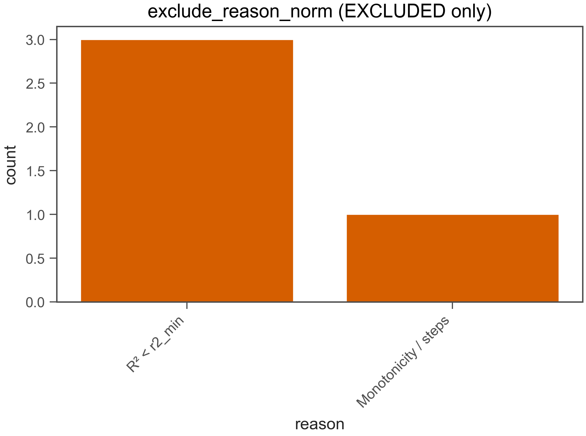

# Fit QC Report

- Generated: 2026-02-12 00:12:27.054832

## (a) OK / EXCLUDED
- Total wells: 112
- OK: 108
- EXCLUDED: 4
- OK rate: 96.4%

- CSV: fit_qc_summary_overall.csv
- CSV (by plate): fit_qc_summary_by_plate.csv
- CSV (by heat): fit_qc_summary_by_heat.csv

## (b) Selected t_end distribution
- t_end min/max: 66 / 606 s
- q10: 96 s
- q25: 156 s
- q50: 156 s
- q75: 606 s
- q90: 606 s

- t_end ≤ 30 s : 0.0%
- t_end ≤ 60 s : 0.0%
- t_end ≤ 120 s : 23.1%
- t_end ≤ 240 s : 59.3%

## (c) Slope vs t_end
- N (finite): 108
- Pearson r: -0.655
- Spearman ρ: -0.6408

## (d) select_method_used breakdown (OK only)
- method column used: select_method_used
- force_whole* fraction (among OK): 0.0%
- force_whole* fraction (among ALL wells): 0.0%

- CSV: fit_qc_select_method_counts.csv
- initial_positive_promote_long_ext: 33 (30.6%)
- initial_positive: 33 (30.6%)
- initial_positive_tangent: 23 (21.3%)
- initial_positive_ext: 10 (9.3%)
- initial_positive_post_broad_overfit_ext_neighbor_recheck_right: 2 (1.9%)
- initial_positive_promote_long_ext_early_steep_delayed_steep: 2 (1.9%)
- initial_positive_early_steep_delayed_steep: 1 (0.9%)
- outlier_removed: 1 (0.9%)
- initial_positive_promote_long_ext_early_steep_delayed_steep_col1_consensus_t0: 1 (0.9%)
- initial_positive_early_steep_ext: 1 (0.9%)
- last_resort: 1 (0.9%)

## (e) Distributions (OK only)
### R²
- R² min/max: 0.64 / 1
- R² q10: 0.9811
- R² q25: 0.9964
- R² q50: 0.999
- R² q75: 0.9995
- R² q90: 0.9997

### mono_frac
- mono_frac min/max: 1 / 1
- mono_frac q10: 1
- mono_frac q25: 1
- mono_frac q50: 1
- mono_frac q75: 1
- mono_frac q90: 1

### snr
- snr min/max: 2.121 / 640.5
- snr q10: 14.08
- snr q25: 40.87
- snr q50: 79.19
- snr q75: 118.7
- snr q90: 160.8

## (f) Exclude reasons (EXCLUDED only)
- CSV: fit_qc_exclude_reason_norm_counts.csv
- R² < r2_min: 3 (75.0%)
- Monotonicity / steps: 1 (25.0%)

