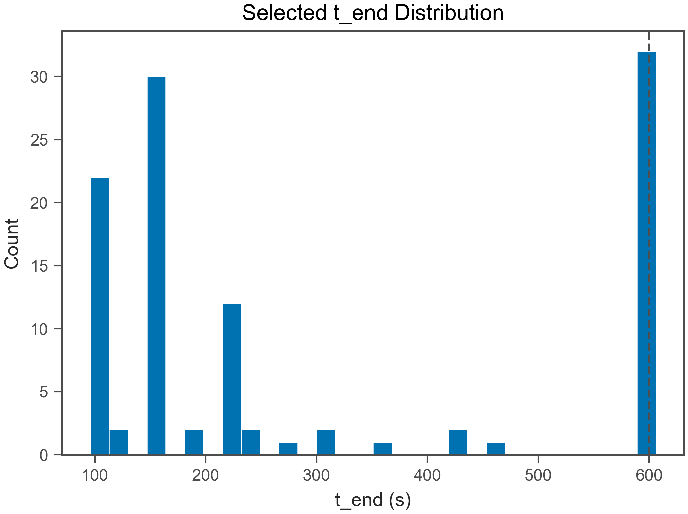
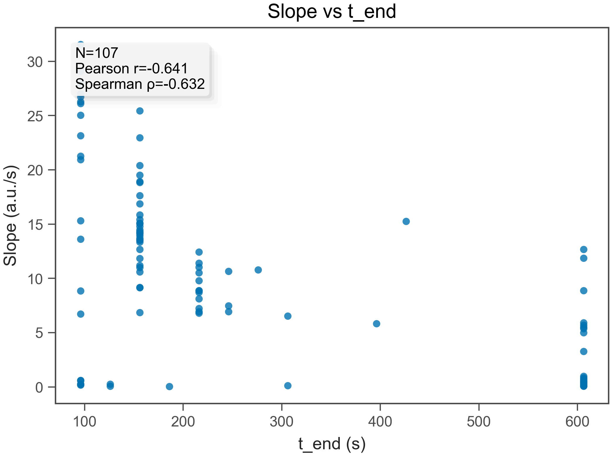
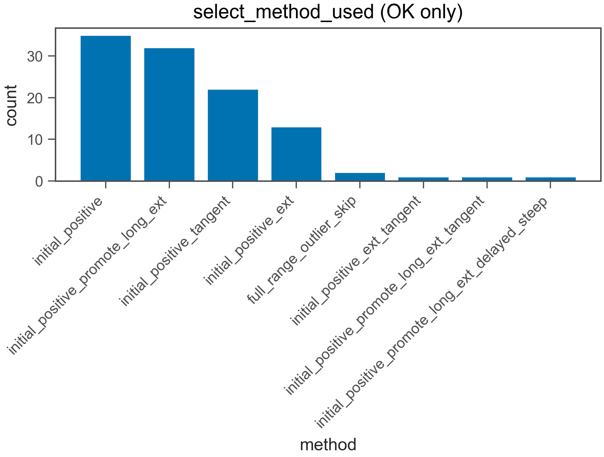
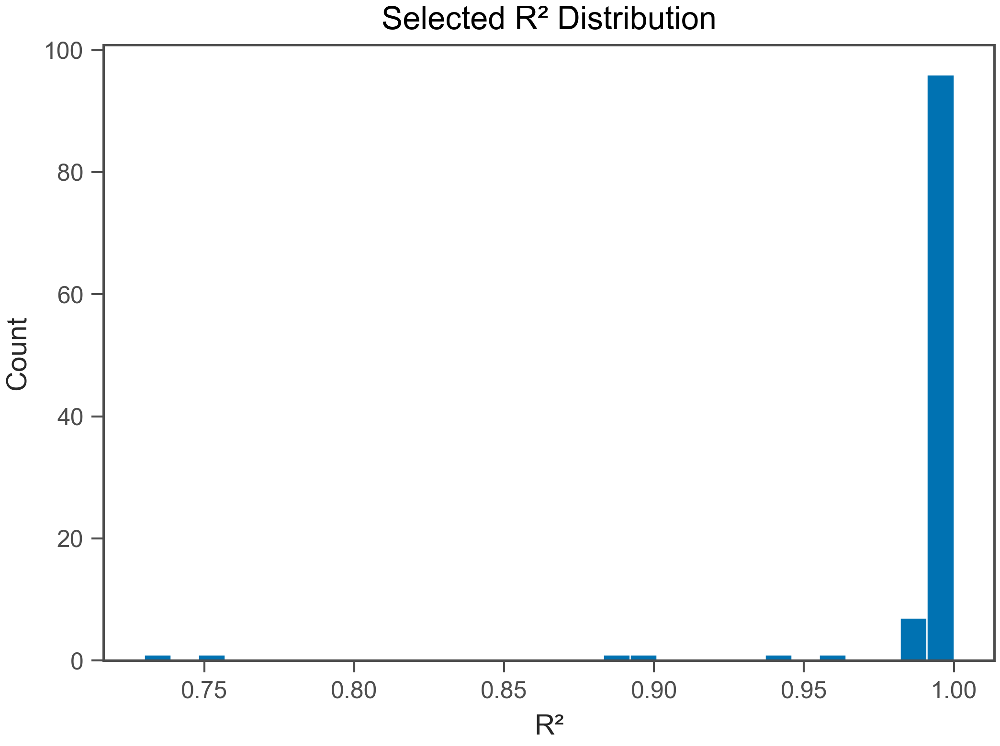
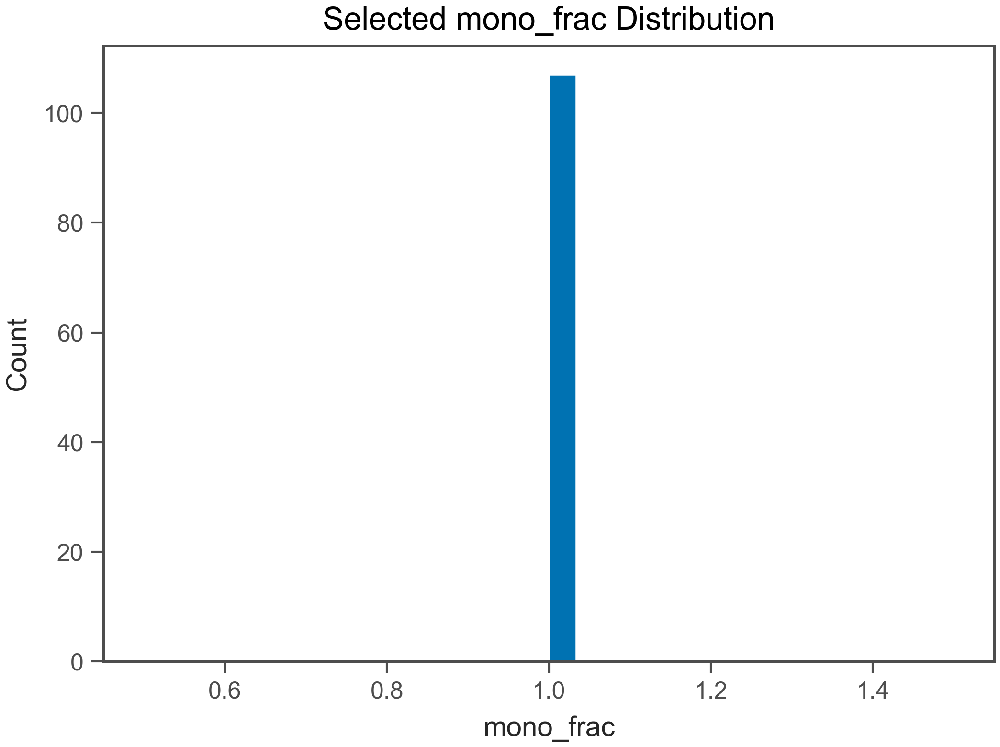
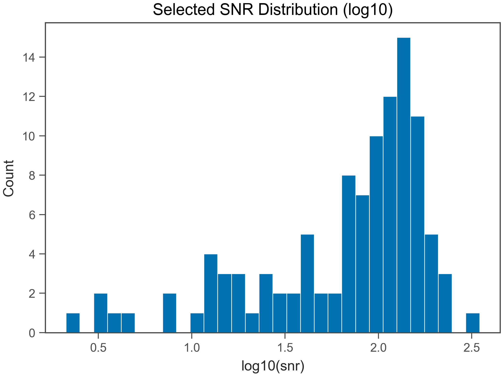
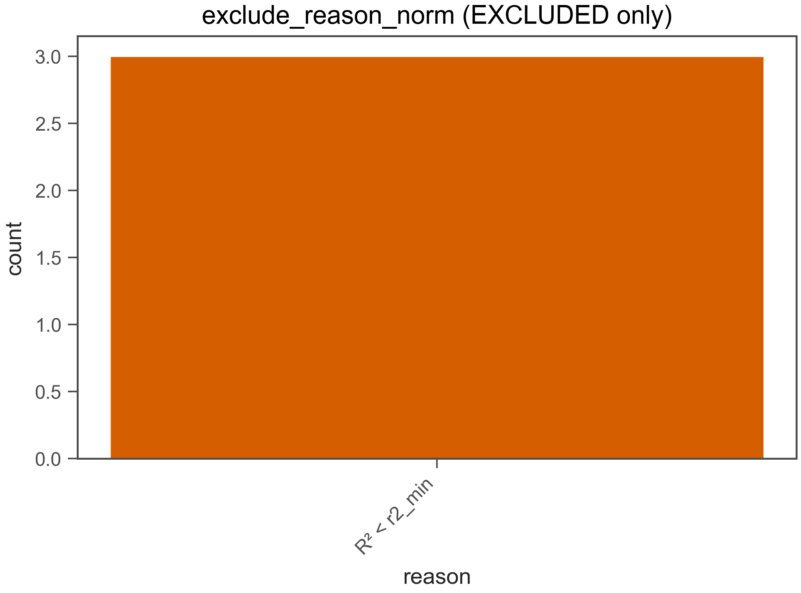

# Fit QC Report

- Generated: 2026-02-11 10:15:49.737739

## (a) OK / EXCLUDED
- Total wells: 112
- OK: 109
- EXCLUDED: 3
- OK rate: 97.3%

- CSV: fit_qc_summary_overall.csv
- CSV (by plate): fit_qc_summary_by_plate.csv
- CSV (by heat): fit_qc_summary_by_heat.csv

## (b) Selected t_end distribution
- t_end min/max: 96 / 606 s
- q10: 96 s
- q25: 156 s
- q50: 186 s
- q75: 606 s
- q90: 606 s

- t_end ≤ 30 s : 0.0%
- t_end ≤ 60 s : 0.0%
- t_end ≤ 120 s : 20.2%
- t_end ≤ 240 s : 62.4%
- t_end ≤ 600 s : 70.6%

## (c) Slope vs t_end
- N (finite): 109
- Pearson r: -0.6598
- Spearman ρ: -0.6694

## (d) select_method_used breakdown (OK only)
- method column used: select_method_used
- force_whole* fraction (among OK): 0.0%
- force_whole* fraction (among ALL wells): 0.0%

- CSV: fit_qc_select_method_counts.csv
- initial_positive: 34 (31.2%)
- initial_positive_promote_long_ext: 31 (28.4%)
- initial_positive_tangent: 22 (20.2%)
- initial_positive_ext: 12 (11.0%)
- full_range_outlier_skip: 2 (1.8%)
- initial_positive_intskip1: 2 (1.8%)
- initial_positive_promote_long_ext_tangent: 2 (1.8%)
- initial_positive_post_broad_overfit_ext: 2 (1.8%)
- initial_positive_promote_long_ext_intskip1: 1 (0.9%)
- initial_positive_ext_post_broad_overfit_ext: 1 (0.9%)

## (e) Distributions (OK only)
### R²
- R² min/max: 0.7299 / 1
- R² q10: 0.9903
- R² q25: 0.9972
- R² q50: 0.9993
- R² q75: 0.9996
- R² q90: 0.9998

### mono_frac
- mono_frac min/max: 0.8947 / 1
- mono_frac q10: 1
- mono_frac q25: 1
- mono_frac q50: 1
- mono_frac q75: 1
- mono_frac q90: 1

### snr
- snr min/max: 2.121 / 1.5e+13
- snr q10: 17.35
- snr q25: 43.6
- snr q50: 100.4
- snr q75: 139.5
- snr q90: 176.2

## (f) Exclude reasons (EXCLUDED only)
- CSV: fit_qc_exclude_reason_norm_counts.csv
- R² < r2_min: 3 (100.0%)

