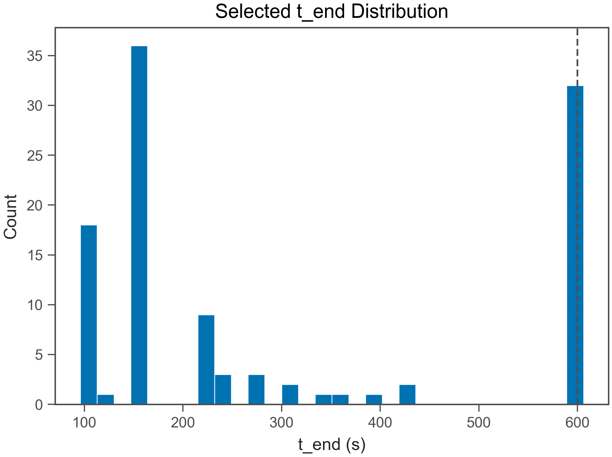
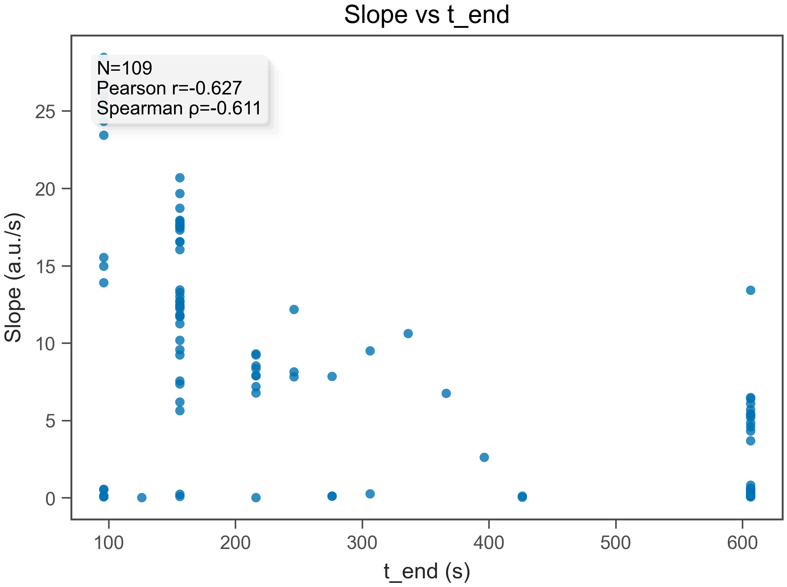
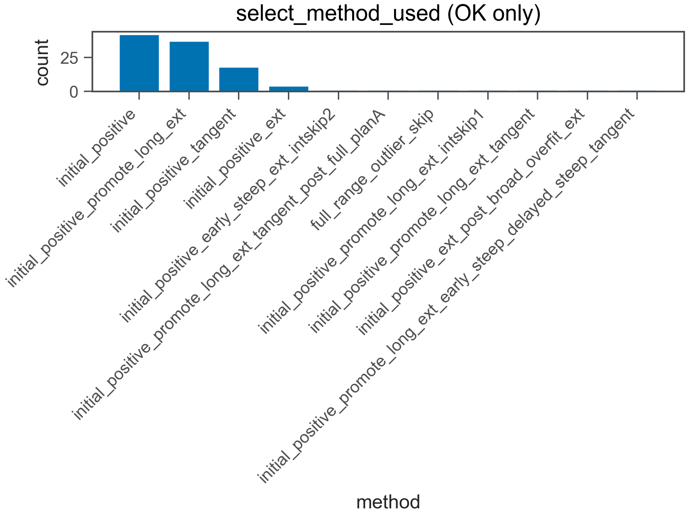
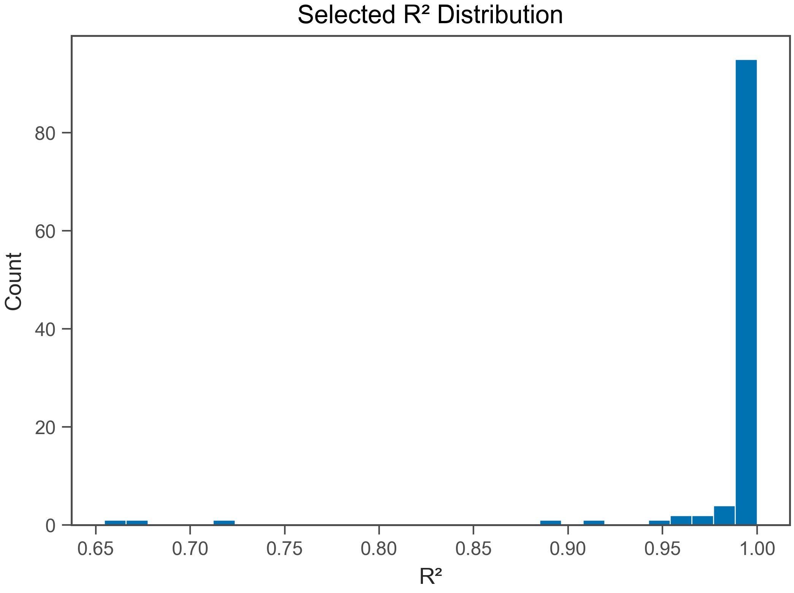
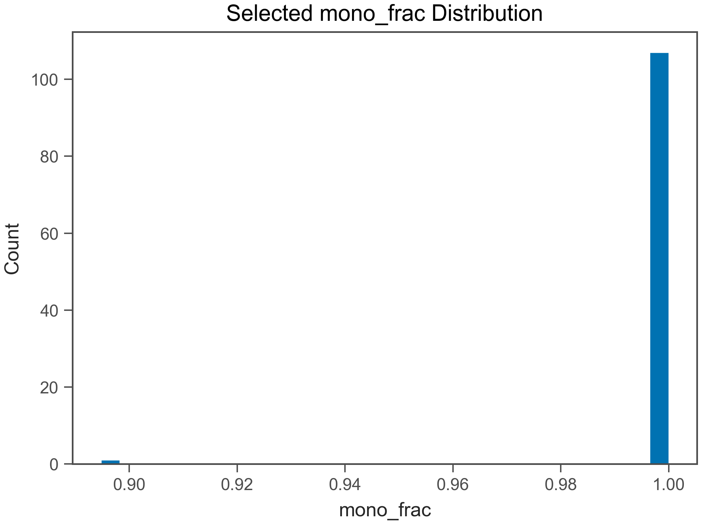
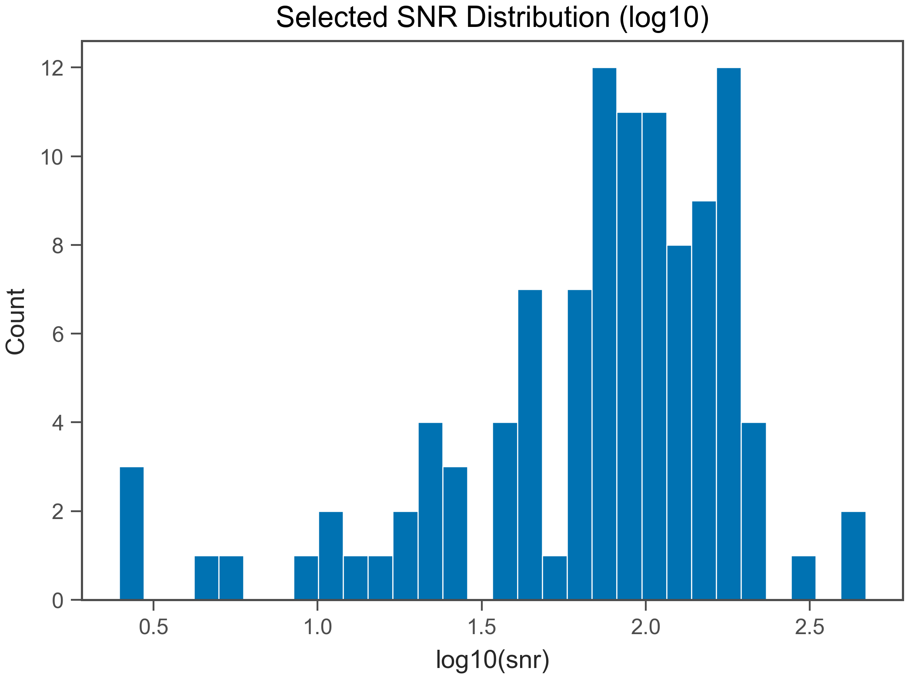
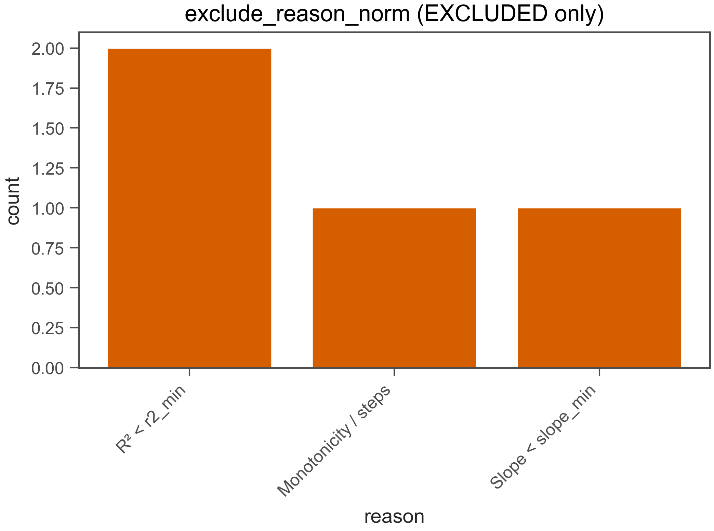

# Fit QC Report

- Generated: 2026-02-11 22:54:32.997260

## (a) OK / EXCLUDED
- Total wells: 112
- OK: 108
- EXCLUDED: 4
- OK rate: 96.4%

- CSV: fit_qc_summary_overall.csv
- CSV (by plate): fit_qc_summary_by_plate.csv
- CSV (by heat): fit_qc_summary_by_heat.csv

## (b) Selected t_end distribution
- t_end min/max: 96 / 606 s
- q10: 96 s
- q25: 156 s
- q50: 156 s
- q75: 606 s
- q90: 606 s

- t_end ≤ 30 s : 0.0%
- t_end ≤ 60 s : 0.0%
- t_end ≤ 120 s : 18.5%
- t_end ≤ 240 s : 63.0%

## (c) Slope vs t_end
- N (finite): 108
- Pearson r: -0.5731
- Spearman ρ: -0.5328

## (d) select_method_used breakdown (OK only)
- method column used: select_method_used
- force_whole* fraction (among OK): 0.0%
- force_whole* fraction (among ALL wells): 0.0%

- CSV: fit_qc_select_method_counts.csv
- initial_positive: 42 (38.9%)
- initial_positive_promote_long_ext: 37 (34.3%)
- initial_positive_tangent: 18 (16.7%)
- initial_positive_ext: 4 (3.7%)
- initial_positive_early_steep_ext_intskip2: 1 (0.9%)
- initial_positive_promote_long_ext_tangent_post_full_planA: 1 (0.9%)
- full_range_outlier_skip: 1 (0.9%)
- initial_positive_promote_long_ext_intskip1: 1 (0.9%)
- initial_positive_promote_long_ext_tangent: 1 (0.9%)
- initial_positive_ext_post_broad_overfit_ext: 1 (0.9%)
- initial_positive_promote_long_ext_early_steep_delayed_steep_tangent: 1 (0.9%)

## (e) Distributions (OK only)
### R²
- R² min/max: 0.6379 / 1
- R² q10: 0.9871
- R² q25: 0.9972
- R² q50: 0.9991
- R² q75: 0.9995
- R² q90: 0.9998

### mono_frac
- mono_frac min/max: 0.8947 / 1
- mono_frac q10: 1
- mono_frac q25: 1
- mono_frac q50: 1
- mono_frac q75: 1
- mono_frac q90: 1

### snr
- snr min/max: 2.485 / 467.6
- snr q10: 19.15
- snr q25: 44.78
- snr q50: 84.81
- snr q75: 141.8
- snr q90: 180.8

## (f) Exclude reasons (EXCLUDED only)
- CSV: fit_qc_exclude_reason_norm_counts.csv
- R² < r2_min: 2 (50.0%)
- Monotonicity / steps: 1 (25.0%)
- Slope < slope_min: 1 (25.0%)

