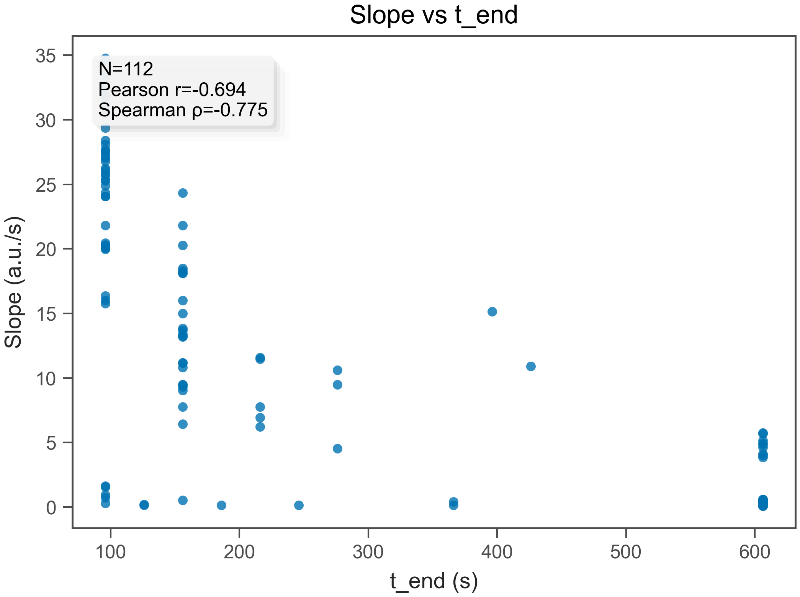
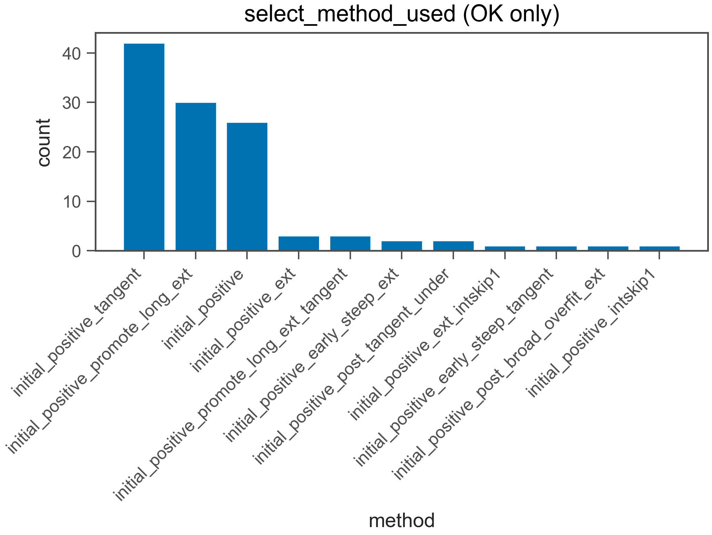
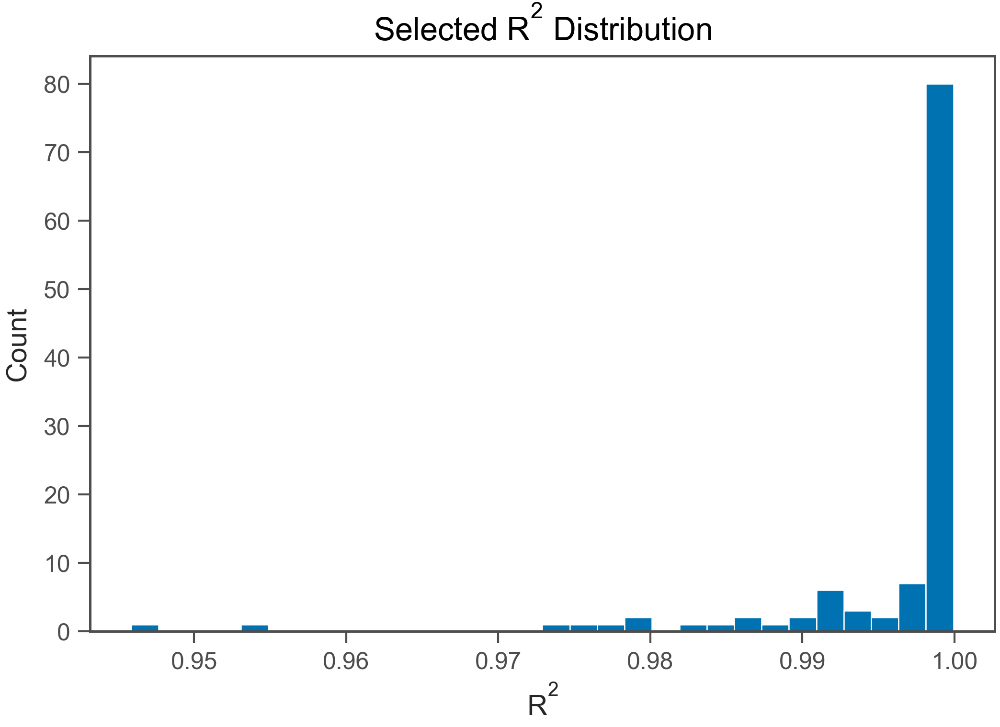
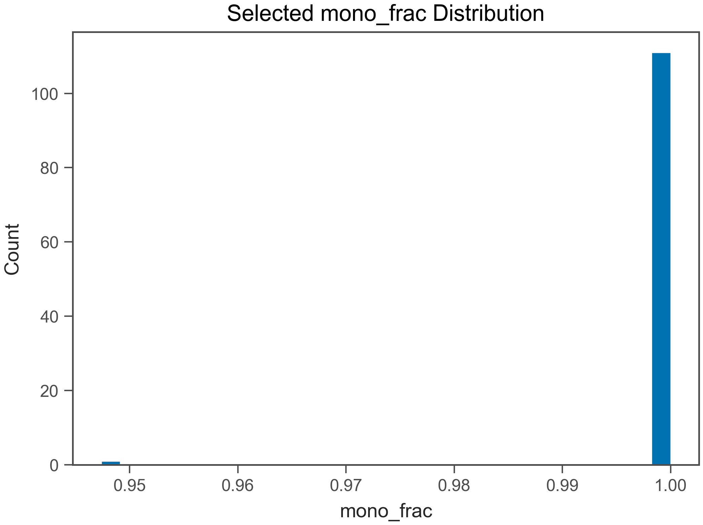
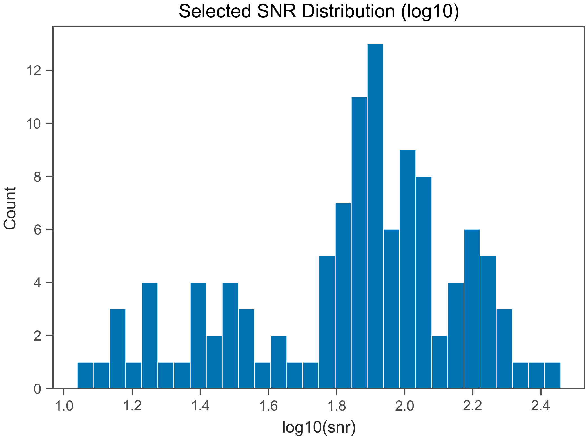

# Fit QC Report

- Generated: 2026-02-18 12:39:11.920745

## (a) OK / EXCLUDED
- Total wells: 112
- OK: 112
- EXCLUDED: 0
- OK rate: 100.0%

- CSV: csv/fit_qc_summary_overall.csv
- CSV (by plate): csv/fit_qc_summary_by_plate.csv
- CSV (by heat): csv/fit_qc_summary_by_heat.csv

## (b) Selected t_end distribution
- t_end min/max: 96 / 606 s
- q10: 96 s
- q25: 96 s
- q50: 156 s
- q75: 471 s
- q90: 606 s

- t_end ≤ 30 s : 0.0%
- t_end ≤ 60 s : 0.0%
- t_end ≤ 120 s : 40.2%
- t_end ≤ 240 s : 67.9%

## (c) Slope vs t_end
- N (finite): 112
- Pearson r: -0.6746
- Spearman ρ: -0.745

## (d) select_method_used breakdown (OK only)
- method column used: select_method_used
- force_whole* fraction (among OK): 0.0%
- force_whole* fraction (among ALL wells): 0.0%

- CSV: csv/fit_qc_select_method_counts.csv
- initial_positive_tangent: 43 (38.4%)
- initial_positive_promote_long_ext: 32 (28.6%)
- initial_positive: 24 (21.4%)
- initial_positive_ext: 3 (2.7%)
- initial_positive_promote_long_ext_tangent: 2 (1.8%)
- initial_positive_ext_tangent: 1 (0.9%)
- initial_positive_early_steep_delayed_steep_ext_intskip1: 1 (0.9%)
- initial_positive_post_tangent_under: 1 (0.9%)
- initial_positive_early_steep_tangent: 1 (0.9%)
- initial_positive_promote_long_ext_early_steep_delayed_steep_tangent: 1 (0.9%)
- initial_positive_post_broad_overfit_ext: 1 (0.9%)
- initial_positive_promote_long_ext_intskip1: 1 (0.9%)
- initial_positive_early_steep_delayed_steep: 1 (0.9%)

## (e) Distributions (OK only)
### R²
- R² min/max: 0.9459 / 0.9999
- R² q10: 0.9876
- R² q25: 0.9977
- R² q50: 0.999
- R² q75: 0.9994
- R² q90: 0.9996

### mono_frac
- mono_frac min/max: 0.9474 / 1
- mono_frac q10: 1
- mono_frac q25: 1
- mono_frac q50: 1
- mono_frac q75: 1
- mono_frac q90: 1

### snr
- snr min/max: 12.66 / 287
- snr q10: 23.67
- snr q25: 53.75
- snr q50: 78.87
- snr q75: 112.9
- snr q90: 154.3

## (f) Exclude reasons (EXCLUDED only)
- excluded wells: 0
