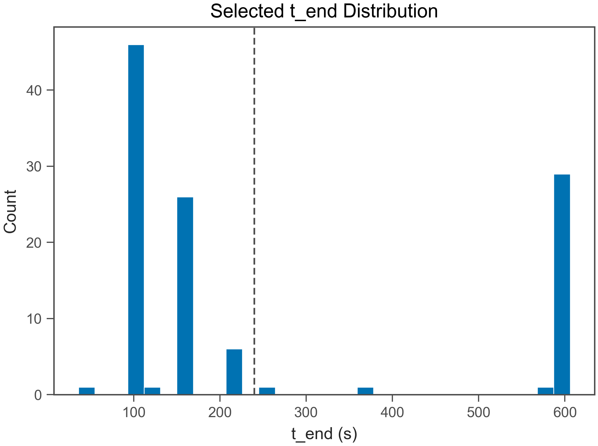
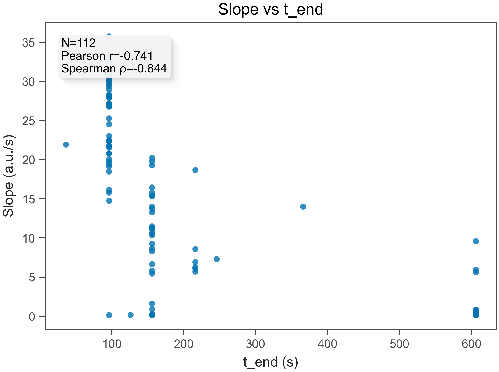
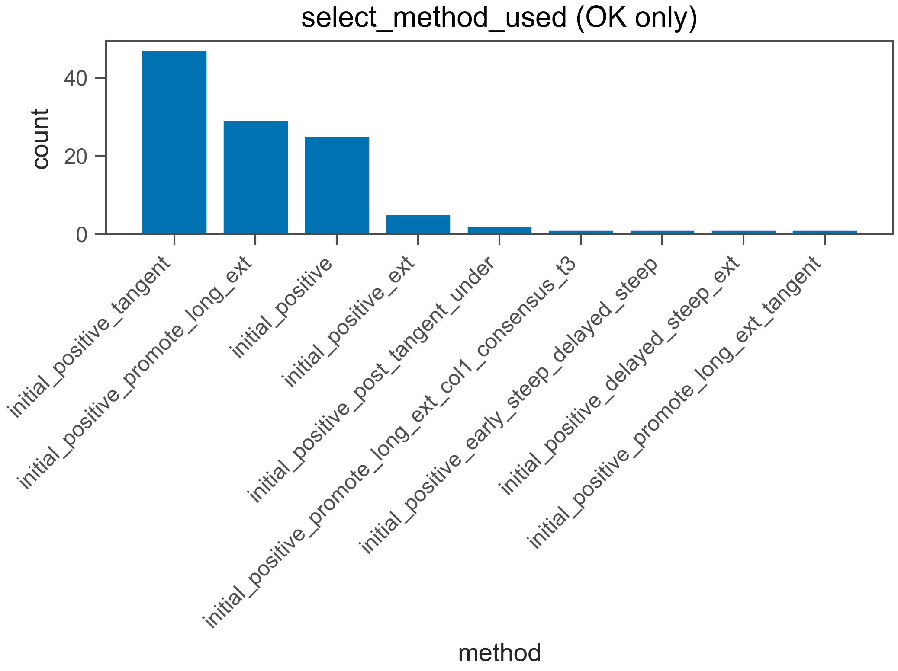
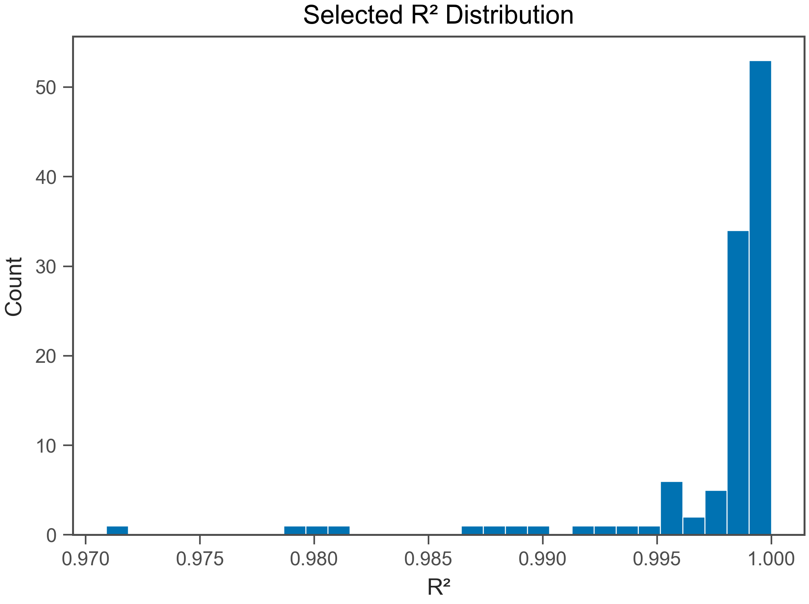
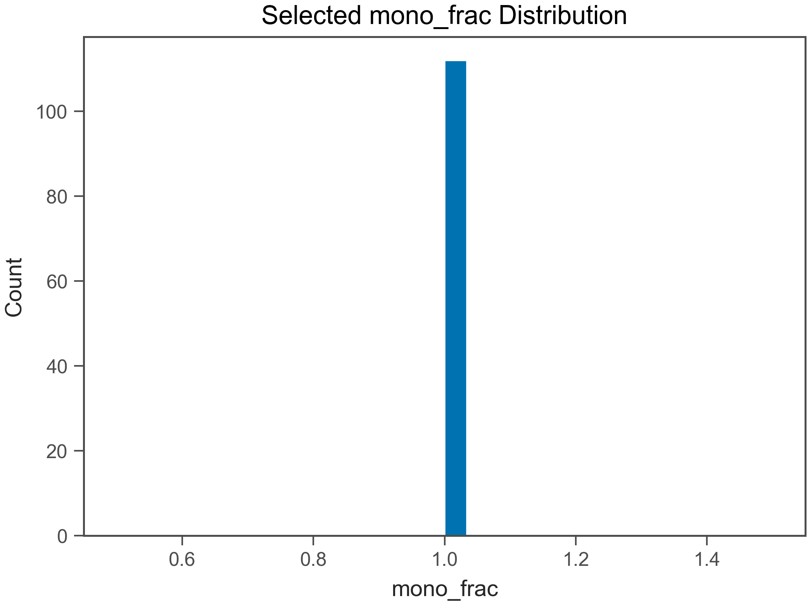

# Fit QC Report

- Generated: 2026-02-11 22:57:37.721955

## (a) OK / EXCLUDED
- Total wells: 112
- OK: 112
- EXCLUDED: 0
- OK rate: 100.0%

- CSV: fit_qc_summary_overall.csv
- CSV (by plate): fit_qc_summary_by_plate.csv
- CSV (by heat): fit_qc_summary_by_heat.csv

## (b) Selected t_end distribution
- t_end min/max: 36 / 606 s
- q10: 96 s
- q25: 96 s
- q50: 156 s
- q75: 426 s
- q90: 606 s

- t_end ≤ 30 s : 0.0%
- t_end ≤ 60 s : 0.9%
- t_end ≤ 120 s : 43.8%
- t_end ≤ 240 s : 73.2%

## (c) Slope vs t_end
- N (finite): 112
- Pearson r: -0.741
- Spearman ρ: -0.8439

## (d) select_method_used breakdown (OK only)
- method column used: select_method_used
- force_whole* fraction (among OK): 0.0%
- force_whole* fraction (among ALL wells): 0.0%

- CSV: fit_qc_select_method_counts.csv
- initial_positive_tangent: 47 (42.0%)
- initial_positive_promote_long_ext: 29 (25.9%)
- initial_positive: 25 (22.3%)
- initial_positive_ext: 5 (4.5%)
- initial_positive_post_tangent_under: 2 (1.8%)
- initial_positive_promote_long_ext_col1_consensus_t3: 1 (0.9%)
- initial_positive_early_steep_delayed_steep: 1 (0.9%)
- initial_positive_delayed_steep_ext: 1 (0.9%)
- initial_positive_promote_long_ext_tangent: 1 (0.9%)

## (e) Distributions (OK only)
### R²
- R² min/max: 0.9709 / 1
- R² q10: 0.995
- R² q25: 0.9982
- R² q50: 0.999
- R² q75: 0.9995
- R² q90: 0.9997

### mono_frac
- mono_frac min/max: 1 / 1
- mono_frac q10: 1
- mono_frac q25: 1
- mono_frac q50: 1
- mono_frac q75: 1
- mono_frac q90: 1

### snr
- snr min/max: 6.07 / 5.669e+14
- snr q10: 31.88
- snr q25: 61.78
- snr q50: 81.96
- snr q75: 114.6
- snr q90: 158.7

## (f) Exclude reasons (EXCLUDED only)
- excluded wells: 0
