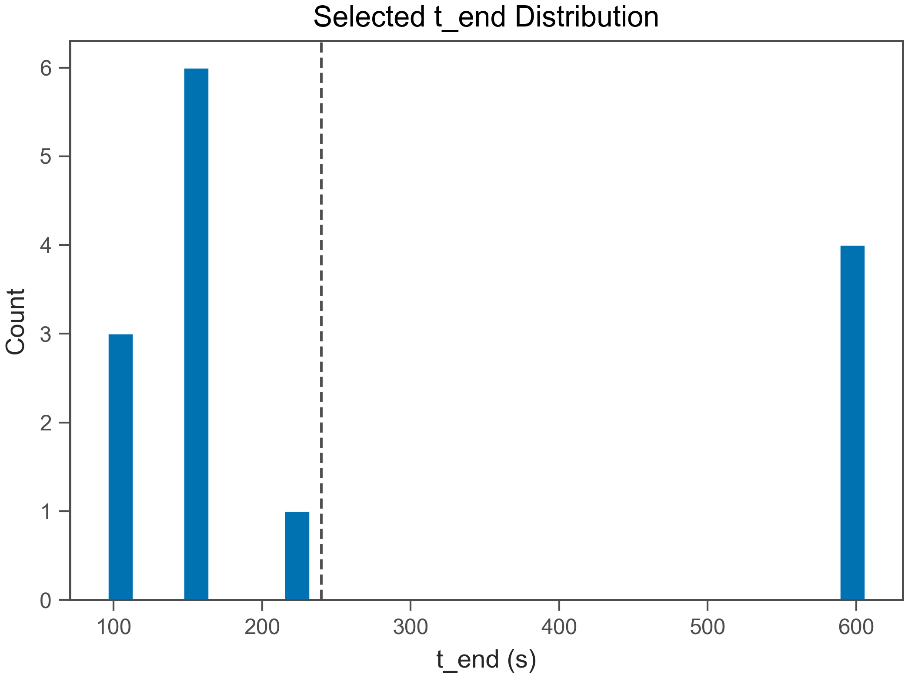
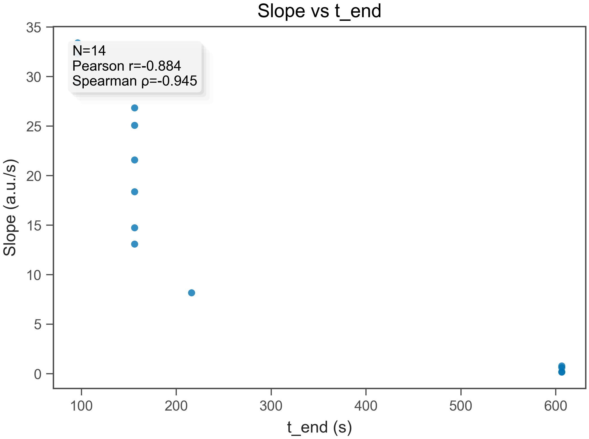
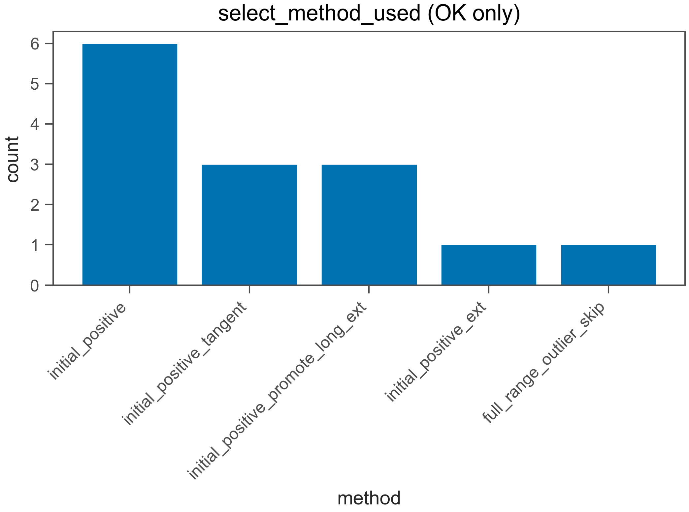
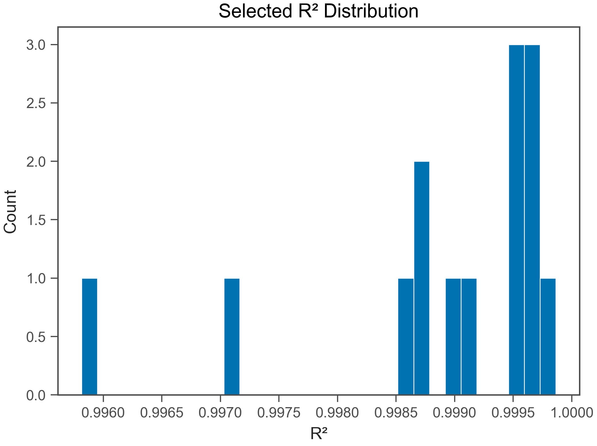
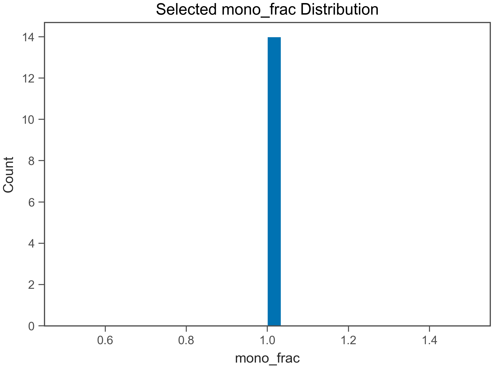

# Fit QC Report

- Generated: 2026-02-11 22:59:08.744863

## (a) OK / EXCLUDED
- Total wells: 14
- OK: 14
- EXCLUDED: 0
- OK rate: 100.0%

- CSV: fit_qc_summary_overall.csv
- CSV (by plate): fit_qc_summary_by_plate.csv
- CSV (by heat): fit_qc_summary_by_heat.csv

## (b) Selected t_end distribution
- t_end min/max: 96 / 606 s
- q10: 96 s
- q25: 156 s
- q50: 156 s
- q75: 508 s
- q90: 606 s

- t_end ≤ 30 s : 0.0%
- t_end ≤ 60 s : 0.0%
- t_end ≤ 120 s : 21.4%
- t_end ≤ 240 s : 71.4%

## (c) Slope vs t_end
- N (finite): 14
- Pearson r: -0.8842
- Spearman ρ: -0.9446

## (d) select_method_used breakdown (OK only)
- method column used: select_method_used
- force_whole* fraction (among OK): 0.0%
- force_whole* fraction (among ALL wells): 0.0%

- CSV: fit_qc_select_method_counts.csv
- initial_positive: 6 (42.9%)
- initial_positive_tangent: 3 (21.4%)
- initial_positive_promote_long_ext: 3 (21.4%)
- initial_positive_ext: 1 (7.1%)
- full_range_outlier_skip: 1 (7.1%)

## (e) Distributions (OK only)
### R²
- R² min/max: 0.9958 / 0.9999
- R² q10: 0.9975
- R² q25: 0.9987
- R² q50: 0.9993
- R² q75: 0.9996
- R² q90: 0.9997

### mono_frac
- mono_frac min/max: 1 / 1
- mono_frac q10: 1
- mono_frac q25: 1
- mono_frac q50: 1
- mono_frac q75: 1
- mono_frac q90: 1

### snr
- snr min/max: 13.89 / 201.7
- snr q10: 55.02
- snr q25: 63.05
- snr q50: 76.51
- snr q75: 125.1
- snr q90: 144.5

## (f) Exclude reasons (EXCLUDED only)
- excluded wells: 0
