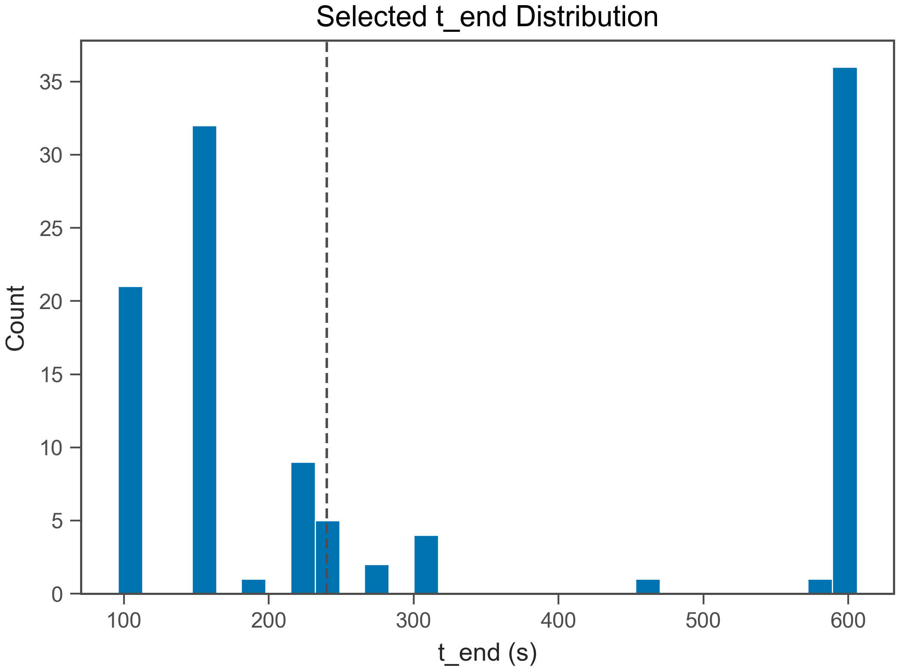
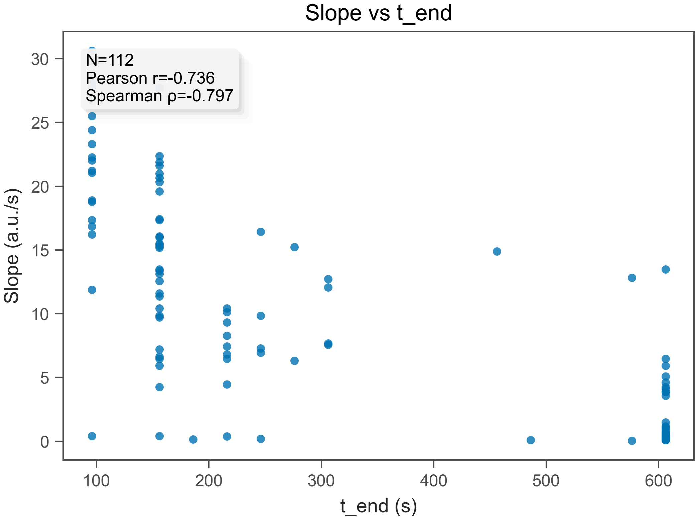
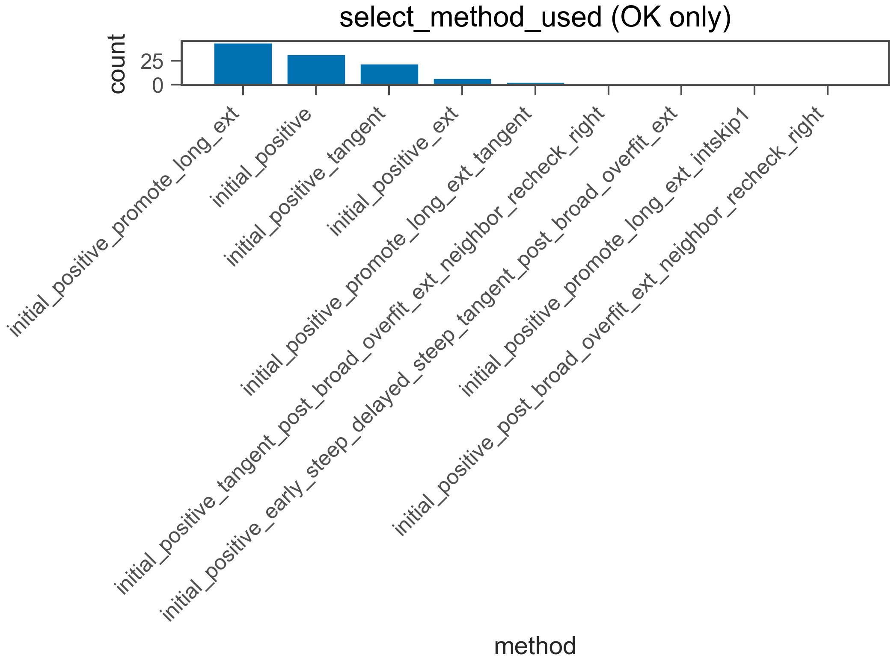
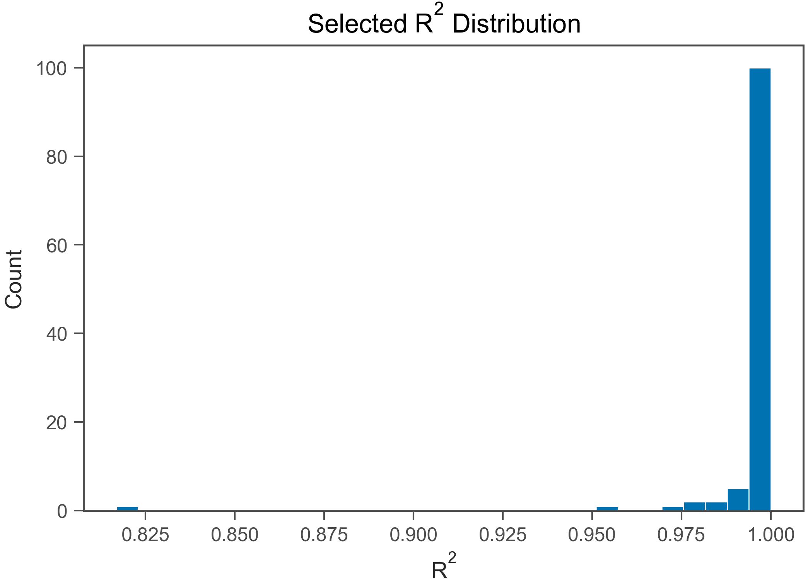
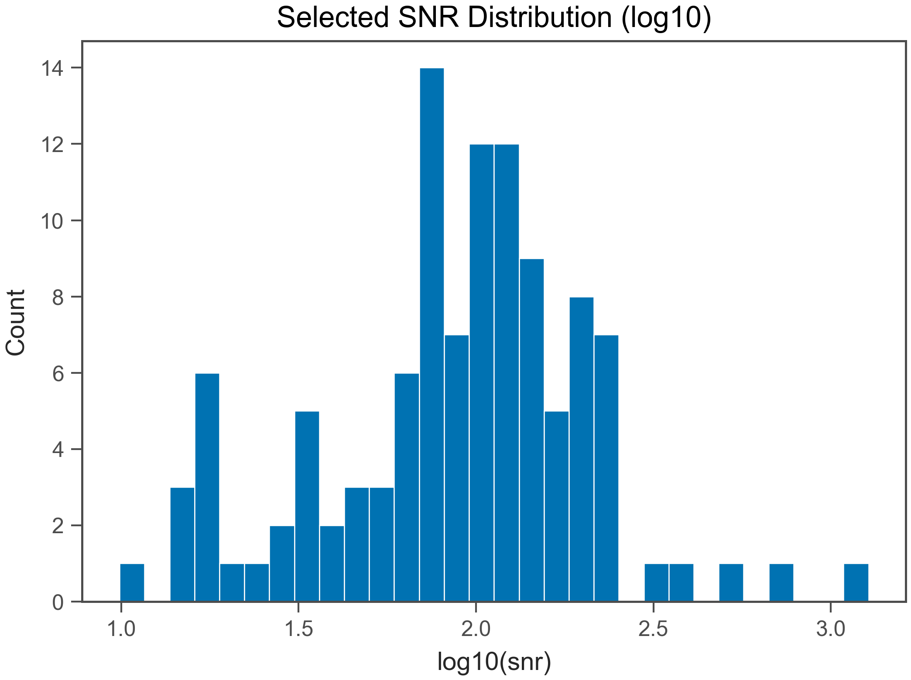

# Fit QC Report

- Generated: 2026-02-16 19:48:49.582380

## (a) OK / EXCLUDED
- Total wells: 112
- OK: 112
- EXCLUDED: 0
- OK rate: 100.0%

- CSV: csv/fit_qc_summary_overall.csv
- CSV (by plate): csv/fit_qc_summary_by_plate.csv
- CSV (by heat): csv/fit_qc_summary_by_heat.csv

## (b) Selected t_end distribution
- t_end min/max: 96 / 606 s
- q10: 96 s
- q25: 156 s
- q50: 216 s
- q75: 606 s
- q90: 606 s

- t_end ≤ 30 s : 0.0%
- t_end ≤ 60 s : 0.0%
- t_end ≤ 120 s : 18.8%
- t_end ≤ 240 s : 56.2%

## (c) Slope vs t_end
- N (finite): 112
- Pearson r: -0.7209
- Spearman ρ: -0.7824

## (d) select_method_used breakdown (OK only)
- method column used: select_method_used
- force_whole* fraction (among OK): 0.0%
- force_whole* fraction (among ALL wells): 0.0%

- CSV: csv/fit_qc_select_method_counts.csv
- initial_positive_promote_long_ext: 44 (39.3%)
- initial_positive: 32 (28.6%)
- initial_positive_tangent: 22 (19.6%)
- initial_positive_ext: 7 (6.2%)
- initial_positive_promote_long_ext_tangent: 3 (2.7%)
- initial_positive_tangent_post_broad_overfit_ext_neighbor_recheck_right: 1 (0.9%)
- initial_positive_early_steep_delayed_steep_tangent_post_broad_overfit_ext: 1 (0.9%)
- initial_positive_promote_long_ext_intskip1: 1 (0.9%)
- initial_positive_post_broad_overfit_ext_neighbor_recheck_right: 1 (0.9%)

## (e) Distributions (OK only)
### R²
- R² min/max: 0.8168 / 1
- R² q10: 0.9931
- R² q25: 0.9985
- R² q50: 0.9992
- R² q75: 0.9996
- R² q90: 0.9998

### mono_frac
- mono_frac min/max: 1 / 1
- mono_frac q10: 1
- mono_frac q25: 1
- mono_frac q50: 1
- mono_frac q75: 1
- mono_frac q90: 1

### snr
- snr min/max: 5.469 / 1277
- snr q10: 28.88
- snr q25: 64.2
- snr q50: 99.74
- snr q75: 147.2
- snr q90: 220.6

## (f) Exclude reasons (EXCLUDED only)
- excluded wells: 0
