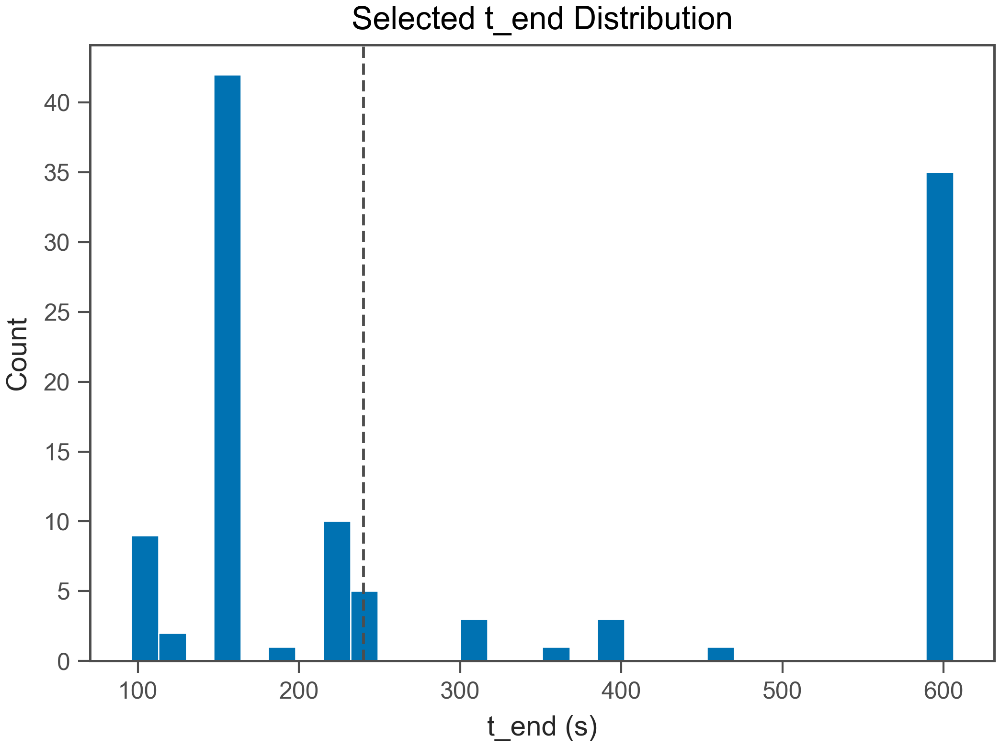
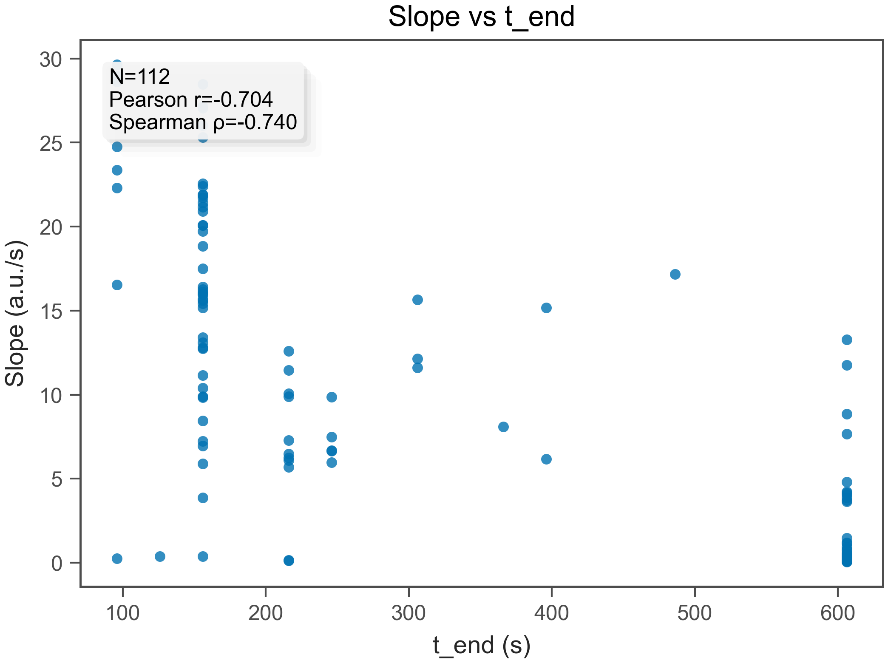
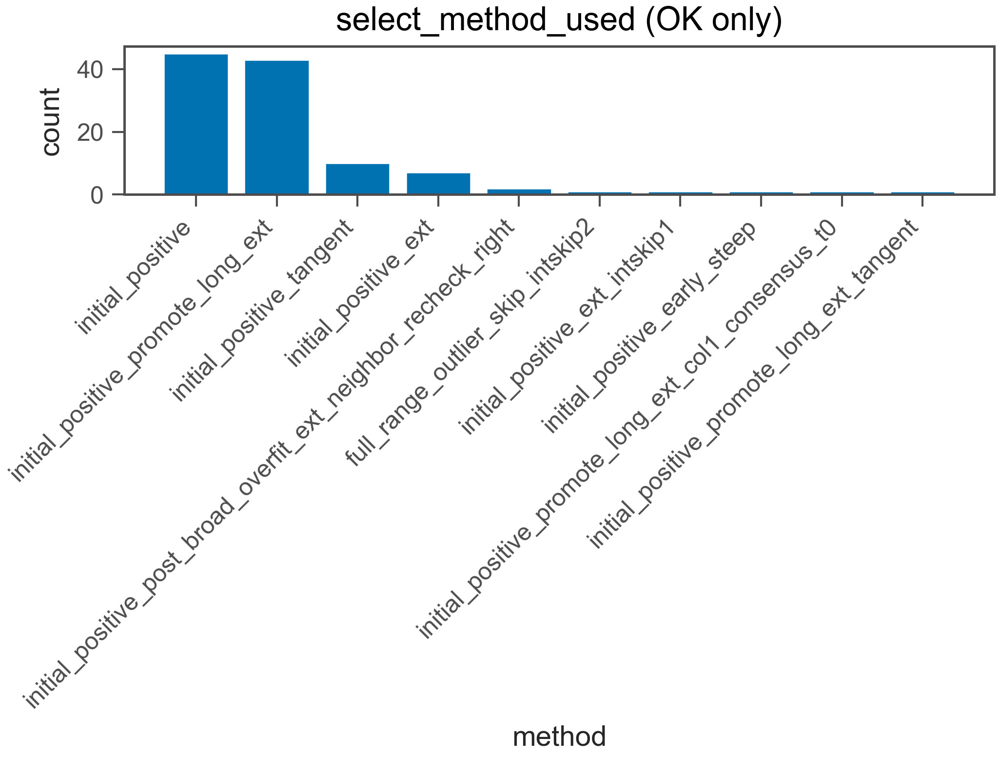
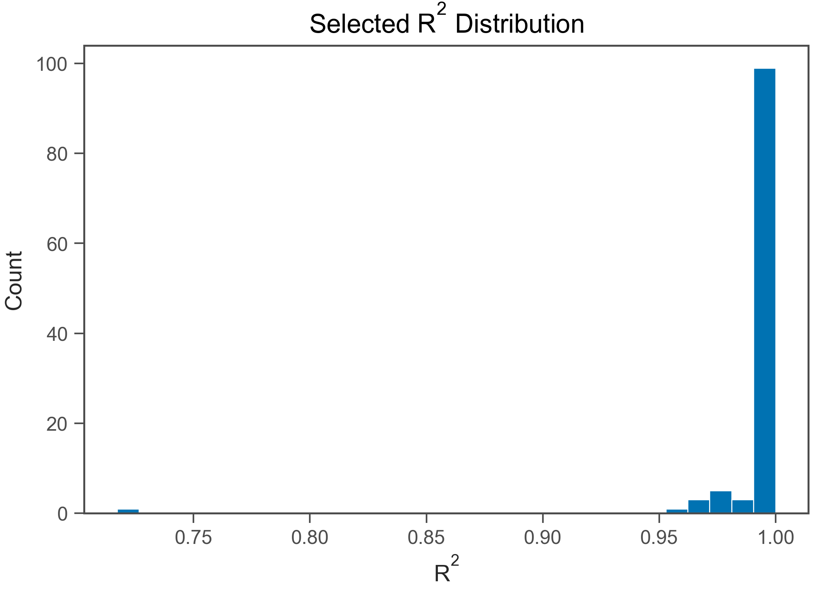
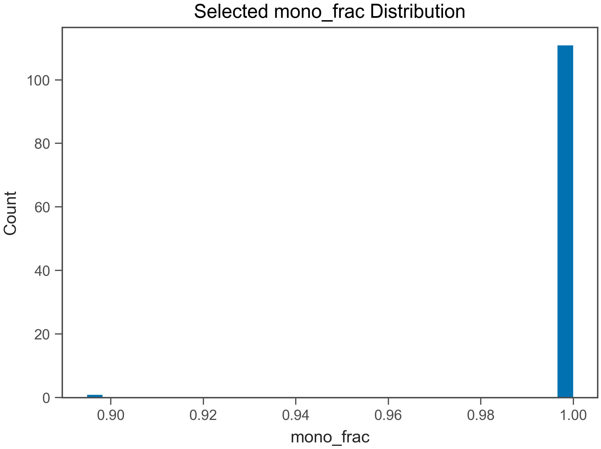
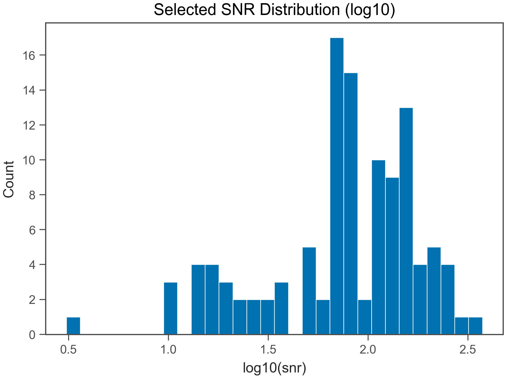

# Fit QC Report

- Generated: 2026-02-18 15:19:08.462882

## (a) OK / EXCLUDED
- Total wells: 112
- OK: 112
- EXCLUDED: 0
- OK rate: 100.0%

- CSV: csv/fit_qc_summary_overall.csv
- CSV (by plate): csv/fit_qc_summary_by_plate.csv
- CSV (by heat): csv/fit_qc_summary_by_heat.csv

## (b) Selected t_end distribution
- t_end min/max: 96 / 606 s
- q10: 156 s
- q25: 156 s
- q50: 216 s
- q75: 606 s
- q90: 606 s

- t_end ≤ 30 s : 0.0%
- t_end ≤ 60 s : 0.0%
- t_end ≤ 120 s : 8.0%
- t_end ≤ 240 s : 55.4%
- t_end ≤ 600 s : 66.1%

## (c) Slope vs t_end
- N (finite): 112
- Pearson r: -0.704
- Spearman ρ: -0.7395

## (d) select_method_used breakdown (OK only)
- method column used: select_method_used
- force_whole* fraction (among OK): 0.0%
- force_whole* fraction (among ALL wells): 0.0%

- CSV: csv/fit_qc_select_method_counts.csv
- initial_positive: 43 (38.4%)
- initial_positive_promote_long_ext: 41 (36.6%)
- initial_positive_ext: 10 (8.9%)
- initial_positive_tangent: 9 (8.0%)
- initial_positive_post_broad_overfit_ext_neighbor_recheck_right: 2 (1.8%)
- full_range_outlier_skip_intskip2: 1 (0.9%)
- initial_positive_ext_intskip1: 1 (0.9%)
- initial_positive_post_broad_overfit_ext: 1 (0.9%)
- initial_positive_promote_long_ext_tangent: 1 (0.9%)
- initial_positive_early_steep_tangent: 1 (0.9%)
- initial_positive_intskip1: 1 (0.9%)
- initial_positive_early_steep_ext: 1 (0.9%)

## (e) Distributions (OK only)
### R²
- R² min/max: 0.8996 / 0.9999
- R² q10: 0.992
- R² q25: 0.9983
- R² q50: 0.999
- R² q75: 0.9996
- R² q90: 0.9998

### mono_frac
- mono_frac min/max: 0.8947 / 1
- mono_frac q10: 1
- mono_frac q25: 1
- mono_frac q50: 1
- mono_frac q75: 1
- mono_frac q90: 1

### snr
- snr min/max: 8.7 / 373.9
- snr q10: 18.23
- snr q25: 55.86
- snr q50: 81.37
- snr q75: 141.6
- snr q90: 191.5

## (f) Exclude reasons (EXCLUDED only)
- excluded wells: 0
