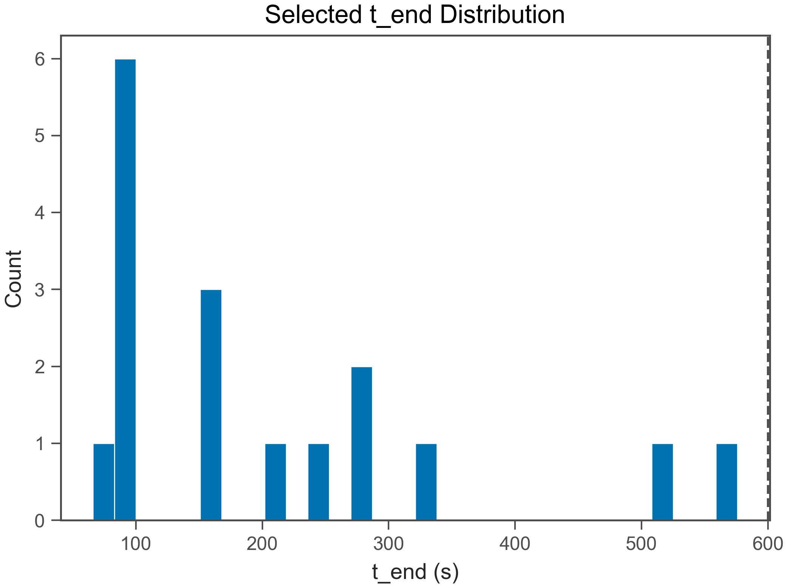
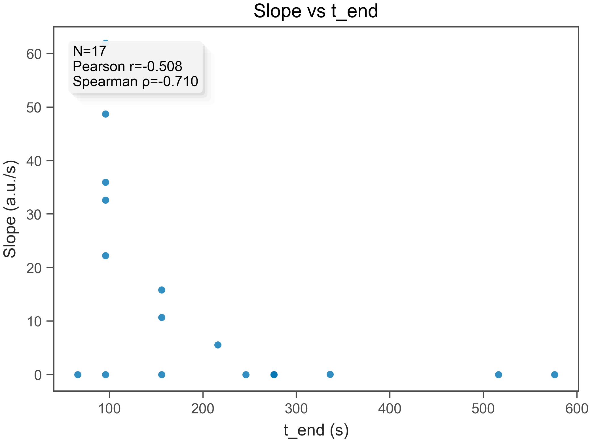
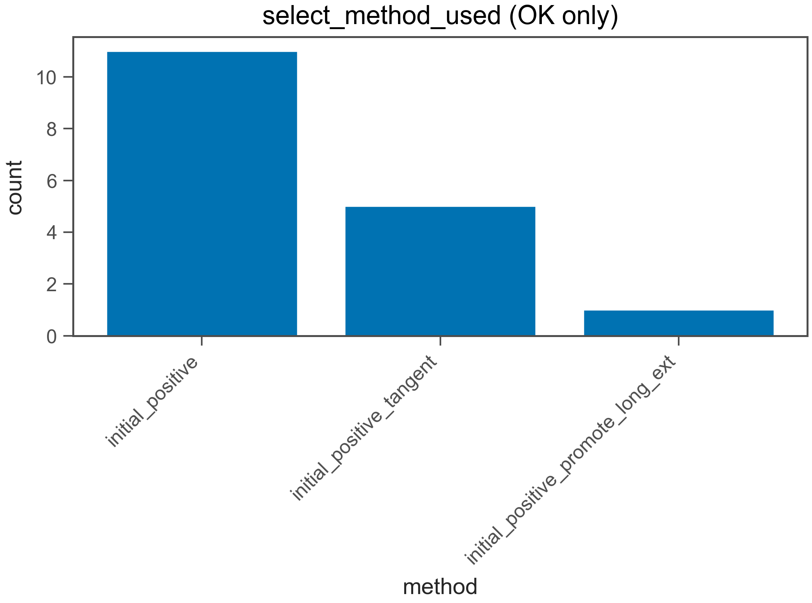
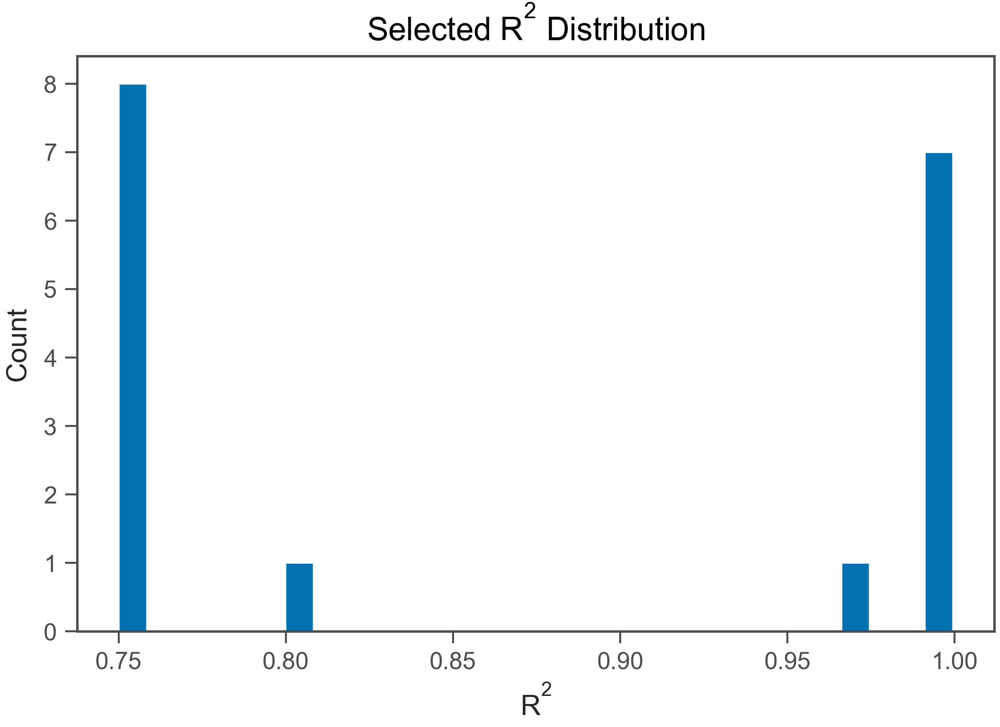
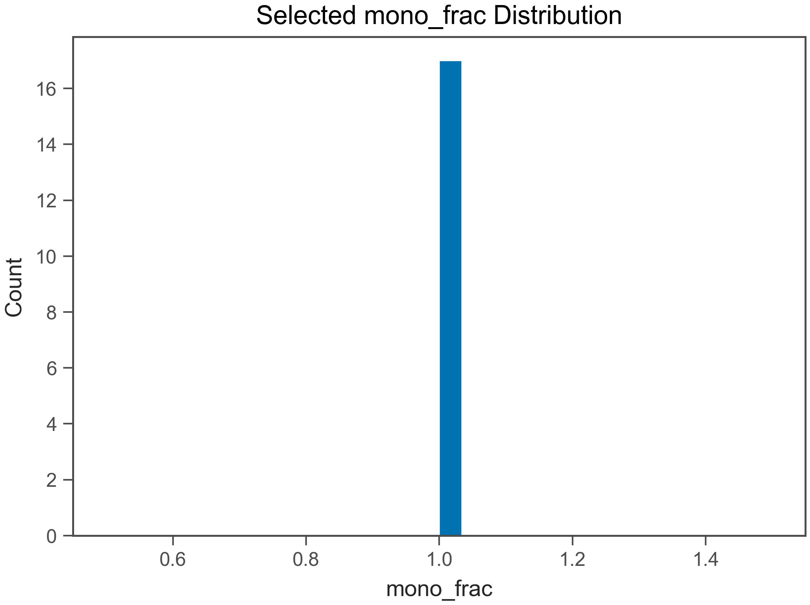
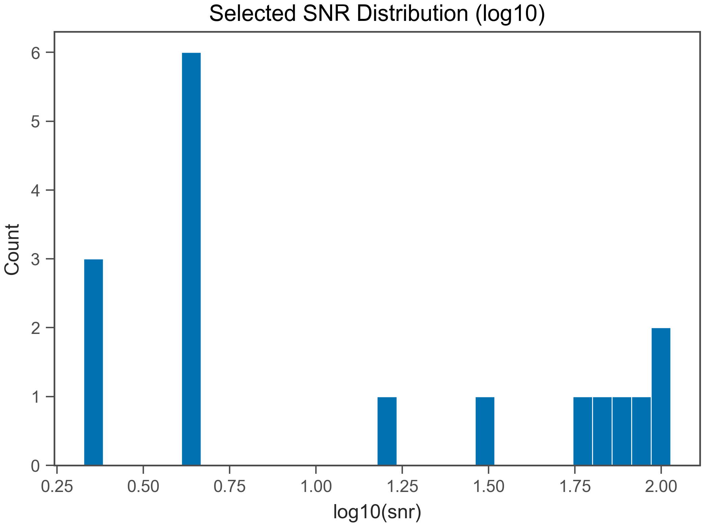
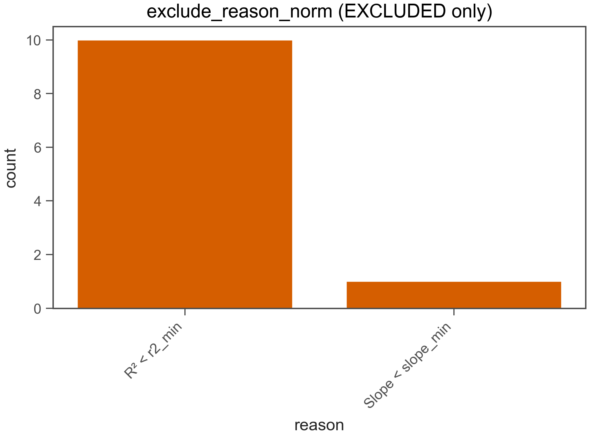

# Fit QC Report

- Generated: 2026-02-18 12:01:50.239837

## (a) OK / EXCLUDED
- Total wells: 28
- OK: 17
- EXCLUDED: 11
- OK rate: 60.7%

- CSV: csv/fit_qc_summary_overall.csv
- CSV (by plate): csv/fit_qc_summary_by_plate.csv
- CSV (by heat): csv/fit_qc_summary_by_heat.csv

## (b) Selected t_end distribution
- t_end min/max: 66 / 576 s
- q10: 96 s
- q25: 96 s
- q50: 156 s
- q75: 276 s
- q90: 408 s

- t_end ≤ 30 s : 0.0%
- t_end ≤ 60 s : 0.0%
- t_end ≤ 120 s : 41.2%
- t_end ≤ 240 s : 64.7%
- t_end ≤ 600 s : 100.0%

## (c) Slope vs t_end
- N (finite): 17
- Pearson r: -0.5078
- Spearman ρ: -0.71

## (d) select_method_used breakdown (OK only)
- method column used: select_method_used
- force_whole* fraction (among OK): 0.0%
- force_whole* fraction (among ALL wells): 0.0%

- CSV: csv/fit_qc_select_method_counts.csv
- initial_positive: 11 (64.7%)
- initial_positive_tangent: 5 (29.4%)
- initial_positive_promote_long_ext: 1 (5.9%)

## (e) Distributions (OK only)
### R²
- R² min/max: 0.75 / 0.9994
- R² q10: 0.75
- R² q25: 0.75
- R² q50: 0.8
- R² q75: 0.9987
- R² q90: 0.9993

### mono_frac
- mono_frac min/max: 1 / 1
- mono_frac q10: 1
- mono_frac q25: 1
- mono_frac q50: 1
- mono_frac q75: 1
- mono_frac q90: 1

### snr
- snr min/max: 2.121 / 106.6
- snr q10: 2.121
- snr q25: 4.082
- snr q50: 4.472
- snr q75: 67.22
- snr q90: 92.24

## (f) Exclude reasons (EXCLUDED only)
- CSV: csv/fit_qc_exclude_reason_norm_counts.csv
- R² < r2_min: 10 (90.9%)
- Slope < slope_min: 1 (9.1%)

