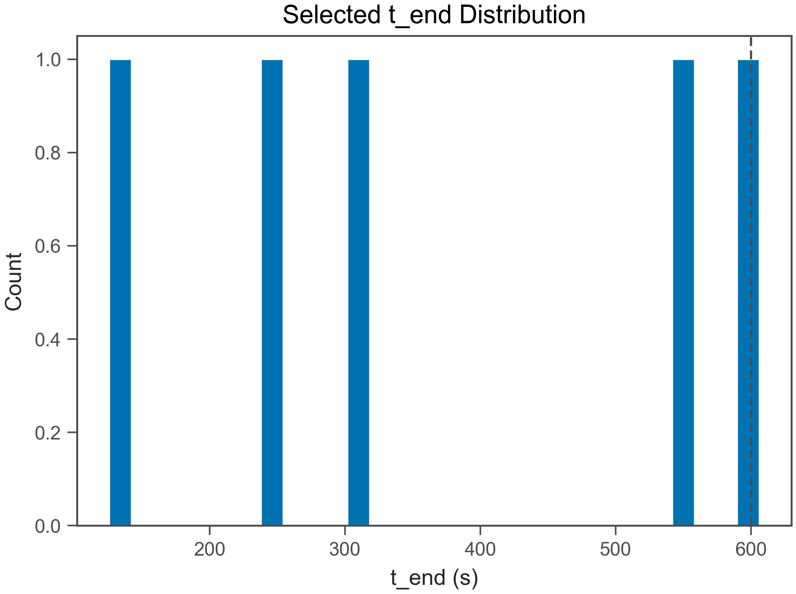
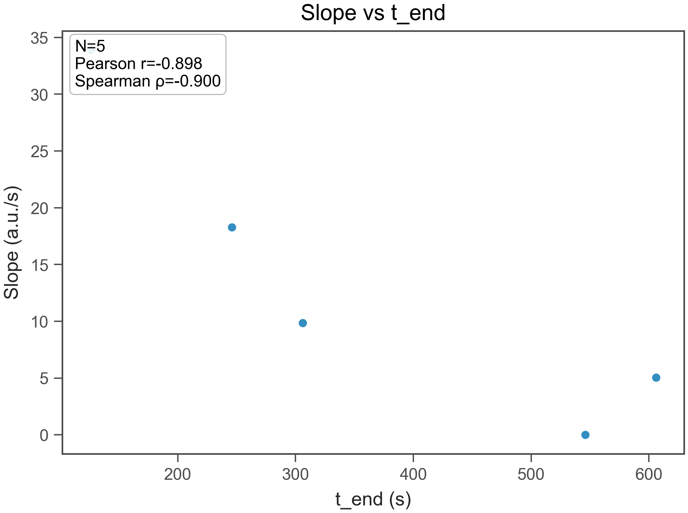
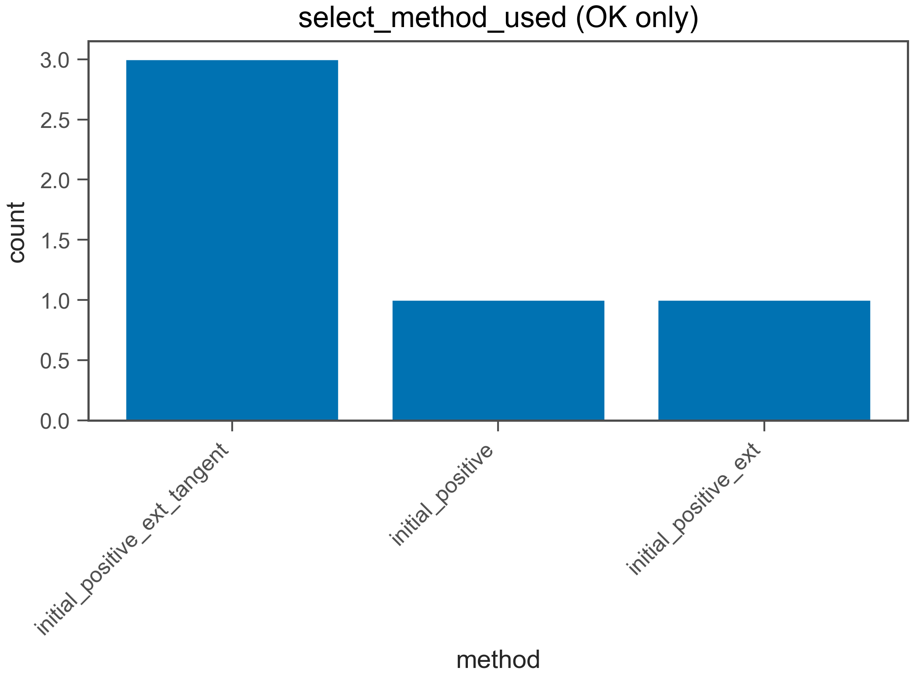
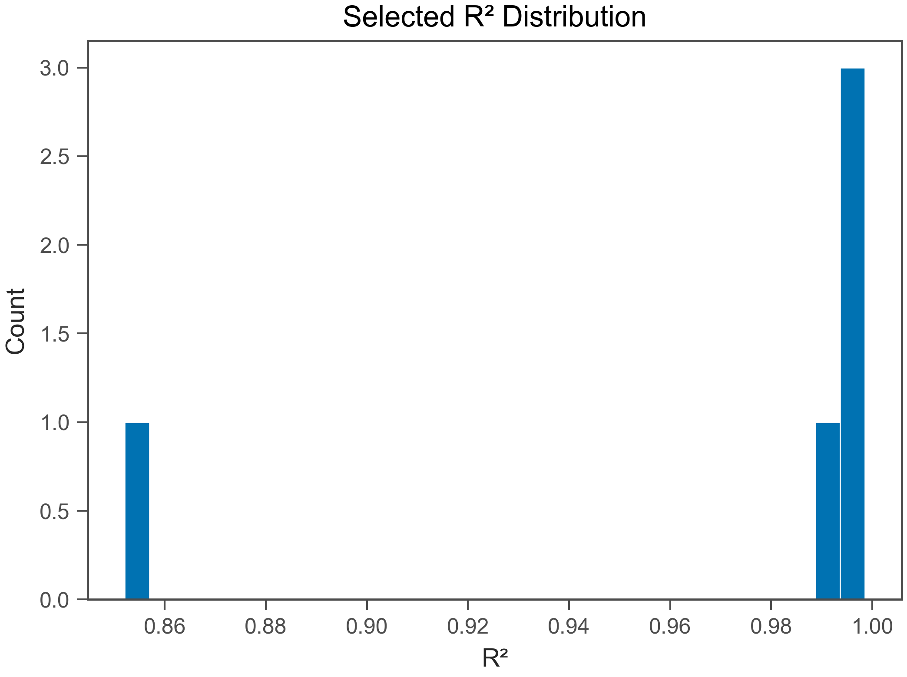
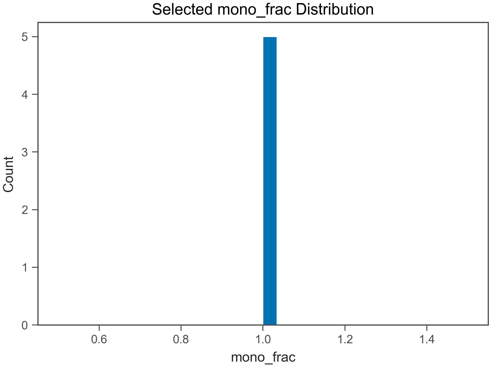
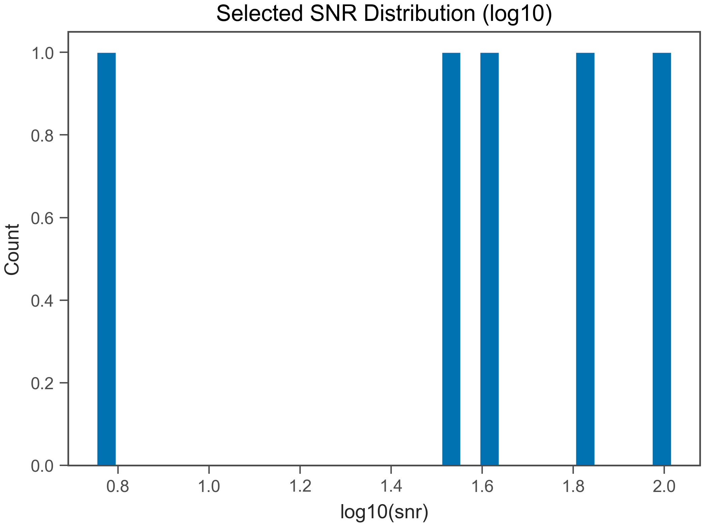
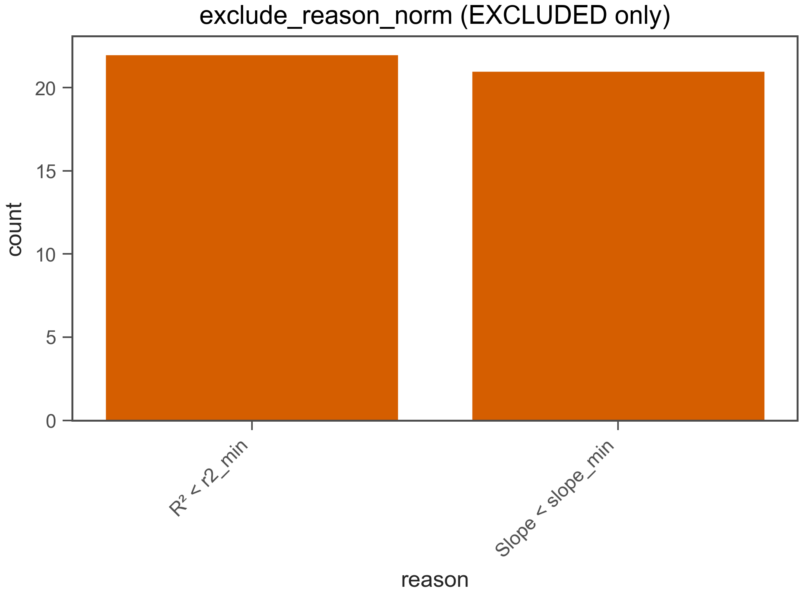

# Fit QC Report

- Generated: 2026-02-03 14:16:20.390369

## (a) OK / EXCLUDED
- Total wells: 48
- OK: 5
- EXCLUDED: 43
- OK rate: 10.4%

- CSV: fit_qc_summary_overall.csv
- CSV (by plate): fit_qc_summary_by_plate.csv
- CSV (by heat): fit_qc_summary_by_heat.csv

## (b) Selected t_end distribution
- t_end min/max: 126 / 606 s
- q10: 174 s
- q25: 246 s
- q50: 306 s
- q75: 546 s
- q90: 582 s

- t_end ≤ 30 s : 0.0%
- t_end ≤ 60 s : 0.0%
- t_end ≤ 120 s : 0.0%
- t_end ≤ 240 s : 20.0%
- t_end ≤ 600 s : 80.0%

## (c) Slope vs t_end
- N (finite): 5
- Pearson r: -0.898
- Spearman ρ: -0.9

## (d) select_method_used breakdown (OK only)
- method column used: select_method_used
- force_whole* fraction (among OK): 0.0%
- force_whole* fraction (among ALL wells): 0.0%

- CSV: fit_qc_select_method_counts.csv
- initial_positive_ext_tangent: 3 (60.0%)
- initial_positive: 1 (20.0%)
- initial_positive_ext: 1 (20.0%)

## (e) Distributions (OK only)
### R²
- R² min/max: 0.8521 / 0.9985
- R² q10: 0.9077
- R² q25: 0.9911
- R² q50: 0.9952
- R² q75: 0.9979
- R² q90: 0.9983

### mono_frac
- mono_frac min/max: 1 / 1
- mono_frac q10: 1
- mono_frac q25: 1
- mono_frac q50: 1
- mono_frac q75: 1
- mono_frac q90: 1

### snr
- snr min/max: 5.676 / 103.6
- snr q10: 16.51
- snr q25: 32.76
- snr q50: 40.56
- snr q75: 68.95
- snr q90: 89.72

## (f) Exclude reasons (EXCLUDED only)
- CSV: fit_qc_exclude_reason_norm_counts.csv
- R² < r2_min: 22 (51.2%)
- Slope < slope_min: 21 (48.8%)

