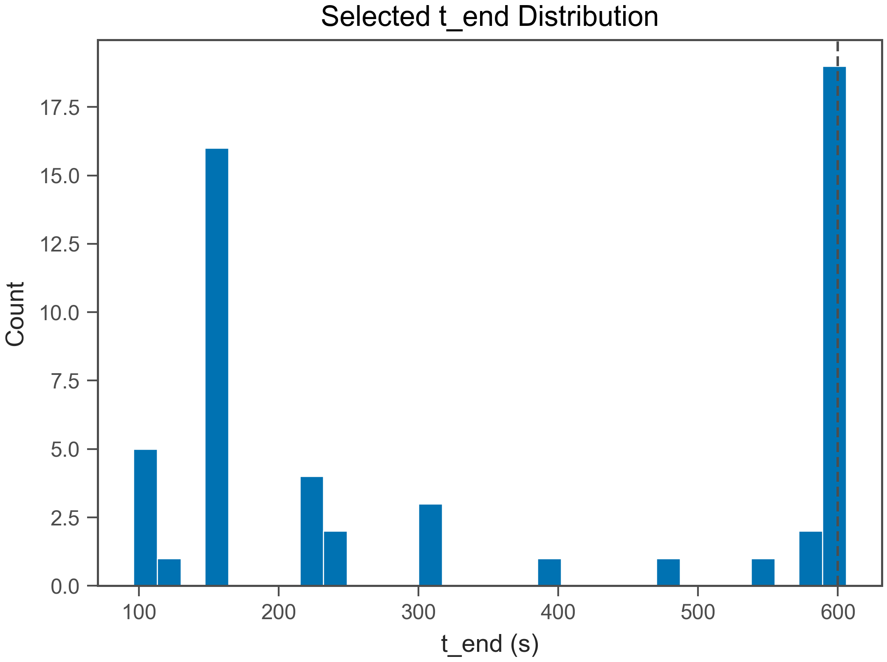
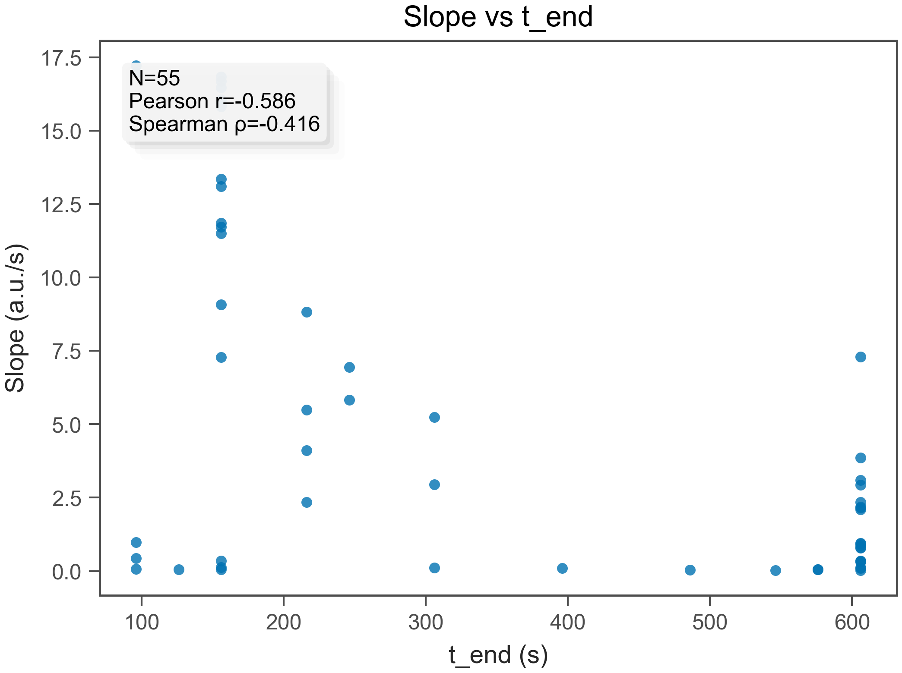
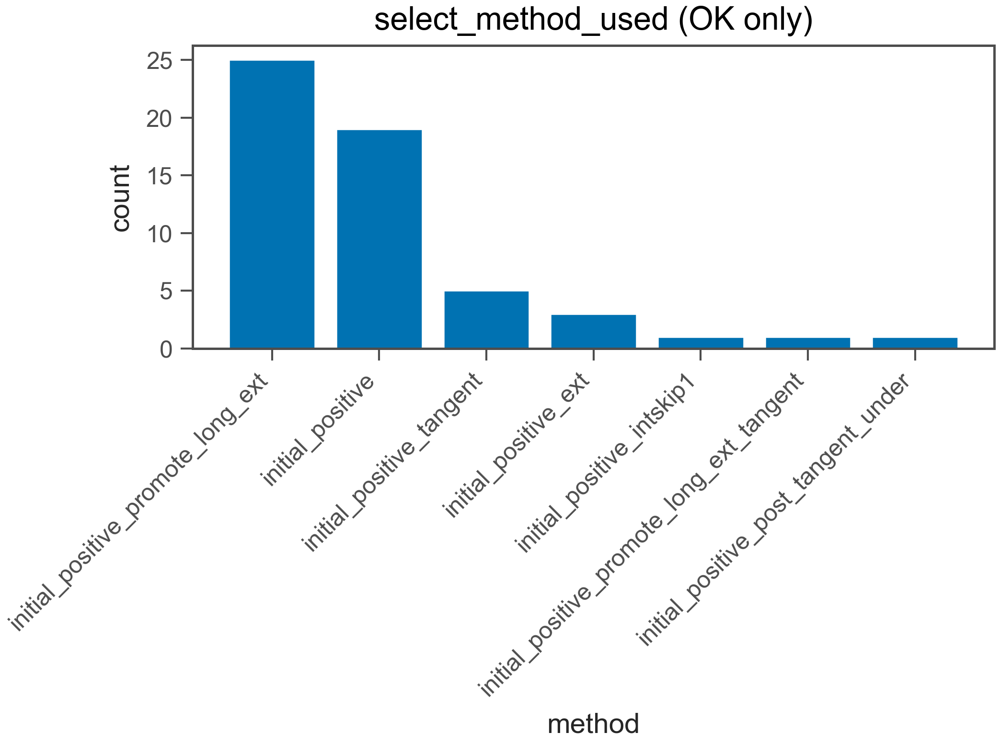
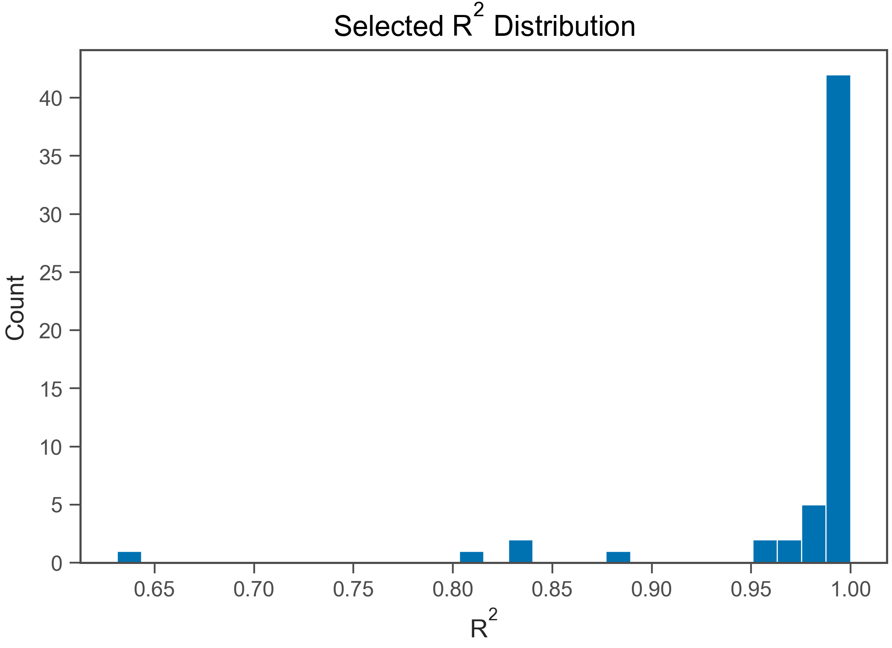
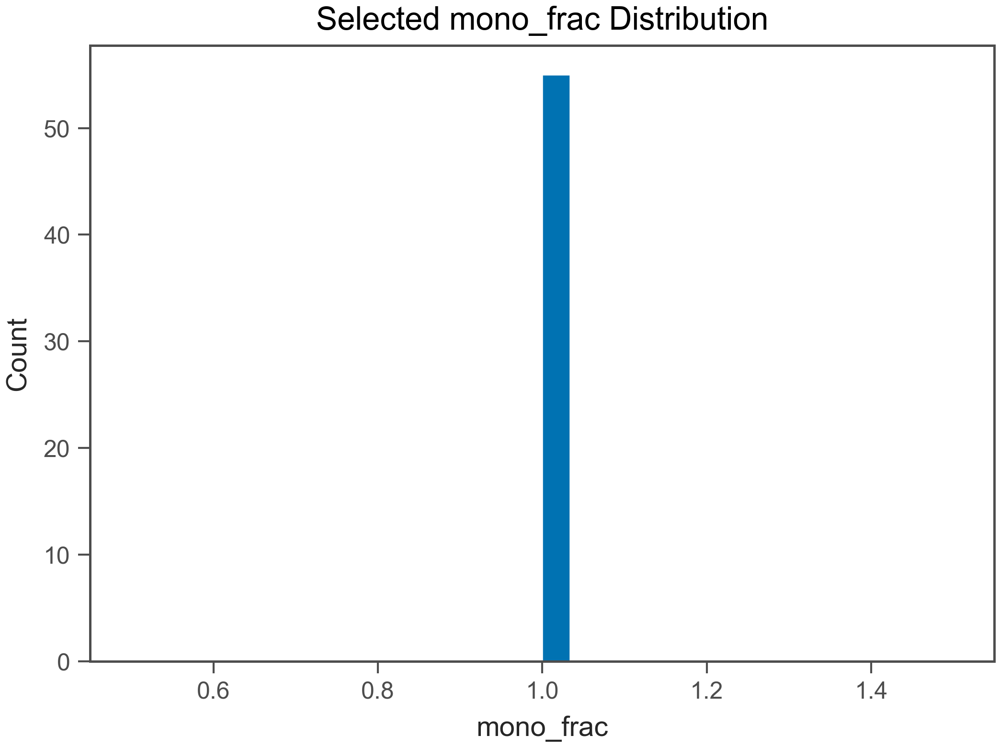
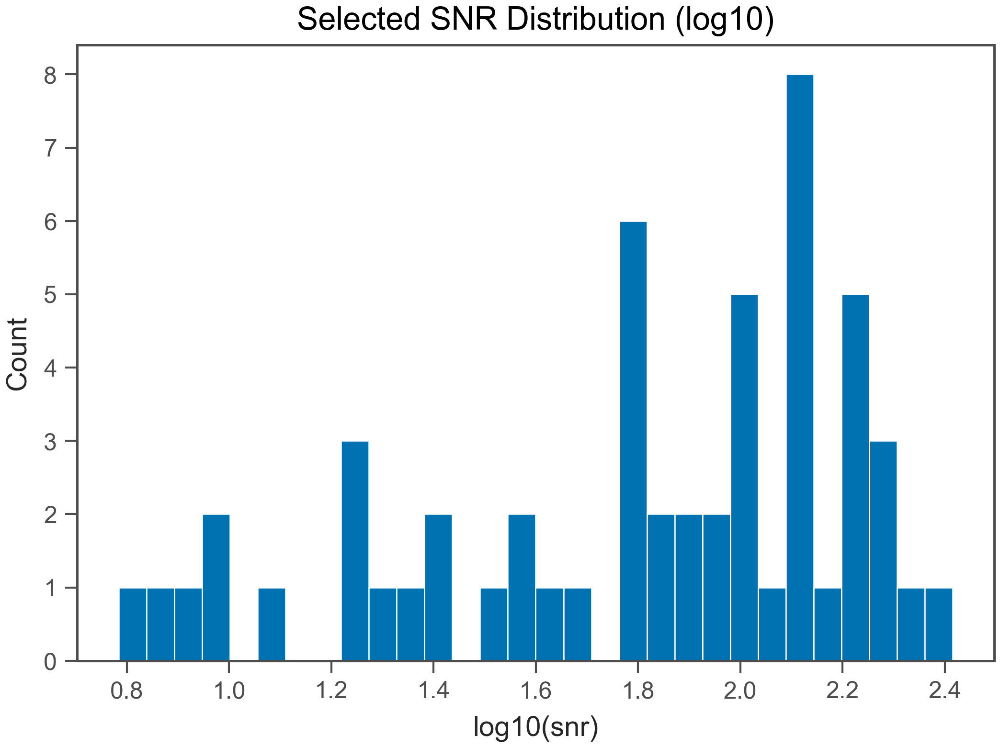
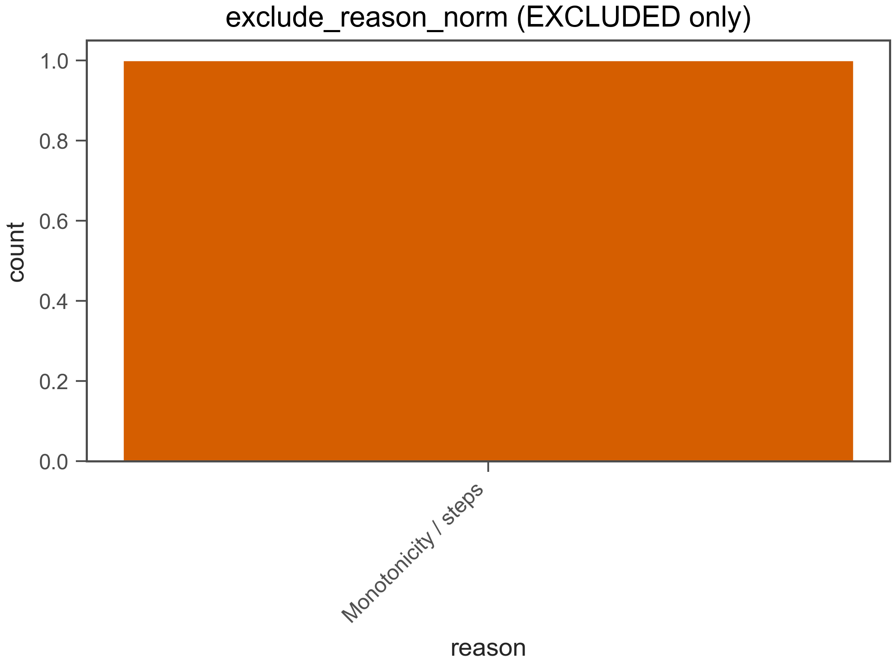

# Fit QC Report

- Generated: 2026-02-17 13:56:36.717958

## (a) OK / EXCLUDED
- Total wells: 56
- OK: 55
- EXCLUDED: 1
- OK rate: 98.2%

- CSV: csv/fit_qc_summary_overall.csv
- CSV (by plate): csv/fit_qc_summary_by_plate.csv
- CSV (by heat): csv/fit_qc_summary_by_heat.csv

## (b) Selected t_end distribution
- t_end min/max: 96 / 606 s
- q10: 138 s
- q25: 156 s
- q50: 246 s
- q75: 606 s
- q90: 606 s

- t_end ≤ 30 s : 0.0%
- t_end ≤ 60 s : 0.0%
- t_end ≤ 120 s : 9.1%
- t_end ≤ 240 s : 47.3%
- t_end ≤ 600 s : 65.5%

## (c) Slope vs t_end
- N (finite): 55
- Pearson r: -0.5859
- Spearman ρ: -0.4163

## (d) select_method_used breakdown (OK only)
- method column used: select_method_used
- force_whole* fraction (among OK): 0.0%
- force_whole* fraction (among ALL wells): 0.0%

- CSV: csv/fit_qc_select_method_counts.csv
- initial_positive_promote_long_ext: 25 (45.5%)
- initial_positive: 19 (34.5%)
- initial_positive_tangent: 5 (9.1%)
- initial_positive_ext: 3 (5.5%)
- initial_positive_intskip1: 1 (1.8%)
- initial_positive_promote_long_ext_tangent: 1 (1.8%)
- initial_positive_post_tangent_under: 1 (1.8%)

## (e) Distributions (OK only)
### R²
- R² min/max: 0.8119 / 0.9999
- R² q10: 0.972
- R² q25: 0.9927
- R² q50: 0.999
- R² q75: 0.9996
- R² q90: 0.9997

### mono_frac
- mono_frac min/max: 1 / 1
- mono_frac q10: 1
- mono_frac q25: 1
- mono_frac q50: 1
- mono_frac q75: 1
- mono_frac q90: 1

### snr
- snr min/max: 6.082 / 260.3
- snr q10: 14.28
- snr q25: 33.74
- snr q50: 77.08
- snr q75: 134.1
- snr q90: 174.4

## (f) Exclude reasons (EXCLUDED only)
- CSV: csv/fit_qc_exclude_reason_norm_counts.csv
- Monotonicity / steps: 1 (100.0%)

