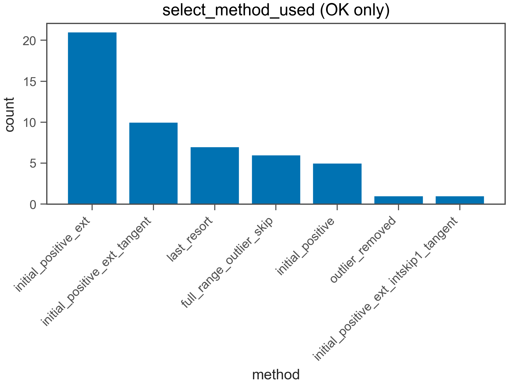
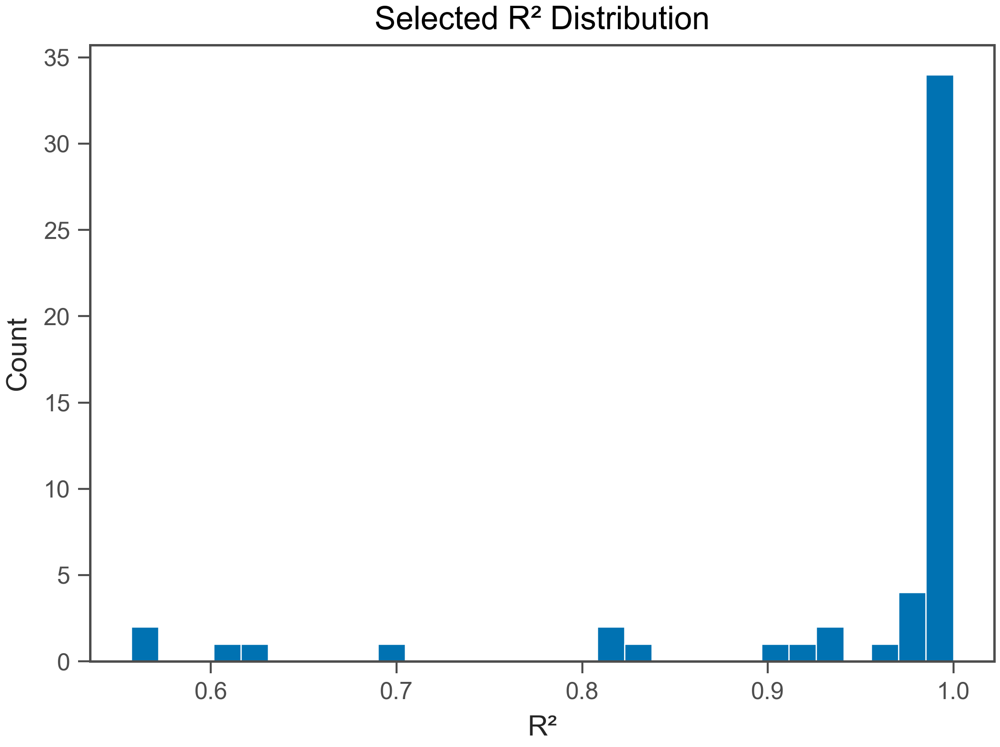

# Fit QC Report

- Generated: 2026-02-03 20:44:25.613060

## (a) OK / EXCLUDED
- Total wells: 56
- OK: 51
- EXCLUDED: 5
- OK rate: 91.1%

- CSV: fit_qc_summary_overall.csv
- CSV (by plate): fit_qc_summary_by_plate.csv
- CSV (by heat): fit_qc_summary_by_heat.csv

## (b) Selected t_end distribution
- t_end min/max: 126 / 606 s
- q10: 186 s
- q25: 231 s
- q50: 486 s
- q75: 606 s
- q90: 606 s

- t_end ≤ 30 s : 0.0%
- t_end ≤ 60 s : 0.0%
- t_end ≤ 120 s : 0.0%
- t_end ≤ 240 s : 25.5%
- t_end ≤ 600 s : 52.9%

## (c) Slope vs t_end
- N (finite): 51
- Pearson r: -0.1275
- Spearman ρ: 0.09995

## (d) select_method_used breakdown (OK only)
- method column used: select_method_used
- force_whole* fraction (among OK): 0.0%
- force_whole* fraction (among ALL wells): 0.0%

- CSV: fit_qc_select_method_counts.csv
- initial_positive_ext: 21 (41.2%)
- initial_positive_ext_tangent: 10 (19.6%)
- last_resort: 7 (13.7%)
- full_range_outlier_skip: 6 (11.8%)
- initial_positive: 5 (9.8%)
- outlier_removed: 1 (2.0%)
- initial_positive_ext_intskip1_tangent: 1 (2.0%)

## (e) Distributions (OK only)
### R²
- R² min/max: 0.5571 / 1
- R² q10: 0.809
- R² q25: 0.9727
- R² q50: 0.9941
- R² q75: 0.9989
- R² q90: 0.9996

### mono_frac
- mono_frac min/max: 0.7143 / 1
- mono_frac q10: 1
- mono_frac q25: 1
- mono_frac q50: 1
- mono_frac q75: 1
- mono_frac q90: 1

### snr
- snr min/max: 2.773 / 320.1
- snr q10: 6.95
- snr q25: 14.06
- snr q50: 24.3
- snr q75: 42.02
- snr q90: 85

## (f) Exclude reasons (EXCLUDED only)
- CSV: fit_qc_exclude_reason_norm_counts.csv
- R² < r2_min: 4 (80.0%)
- Slope < slope_min: 1 (20.0%)

